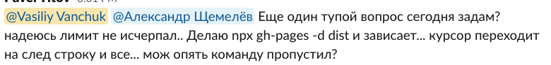
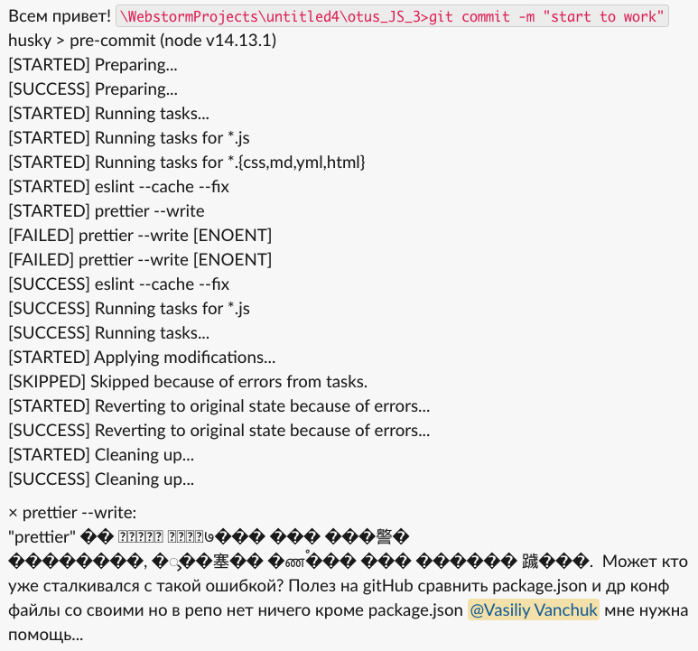
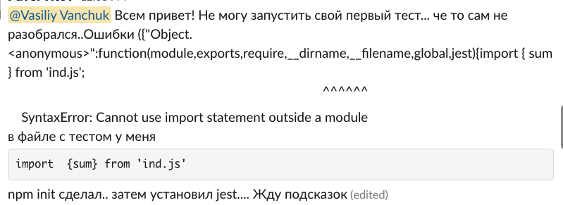
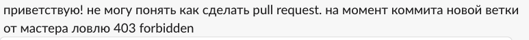

# OTUS

## Javascript Basic

<!--v-->

### Обо мне

Василий Ванчук ([Li](https://www.linkedin.com/in/vvanchuk/)/[Yt](https://www.youtube.com/watch?v=Q5sQGV-n7xU&list=PLX3Jlot18dp4-a9a6B6DP0fYF3R1jjN4K))

<!--v-->

### Преподаватели

[Страница о курсе](https://otus.ru/lessons/javascript-basic/?int_source=courses_catalog&int_term=programming)

<!--v-->

> На курсе вы получите **навыки фронтенд-разработки**

<!--v-->

1. Навыки != знания
1. Фронтенд разработка > Javascript

<!--v-->

### Вопросы?

<!--s-->

## Как проходит общение

<!--v-->

1. Slack (пишем в канал группы, пользуемся ветками в обсуждениях)
2. [Github](https://github.com/vvscode/otus--javascript-basic)
3. Чат с преподавателем в ЛК

<!--v-->

Давайте задавать ["вопросы по-умному"](https://www.opennet.ru/docs/RUS/smart_question/)

<!--v-->

Глупых вопросов нет. Зато есть

1. Не знание
1. Не понимание

На лекциях во всю действует [принцип Парето](https://ru.wikipedia.org/wiki/%D0%97%D0%B0%D0%BA%D0%BE%D0%BD_%D0%9F%D0%B0%D1%80%D0%B5%D1%82%D0%BE). Мы рассказываем ключевые вещи

<!-- v -->

Для работы со знание полезны пара ссылок:

- [Метод интервального повторения — лучший способ изучения языков программирования](https://habr.com/ru/post/196448/)
- [Преимущества метода интервального запоминания](http://web.archive.org/web/20170315102949/https://habrahabr.ru/company/everydaytools/blog/322286/)

<!-- v -->

И приложения на телефоне будут полезны:

- Enki [ios](https://apps.apple.com/us/app/enki-learn-code-data-skills/id993753145) / [android](https://play.google.com/store/apps/details?id=com.enki.insights&hl=ru&gl=US)
- Solo Learn [ios](https://apps.apple.com/us/app/sololearn-learn-to-code/id1210079064) / [android](https://play.google.com/store/apps/details?id=com.sololearn&hl=ru&gl=US)

<!--v-->

Две крайности в задавании вопросов:

1. Спрашивать сразу
1. Не спрашивать вовремя

**Действуем по правилу n-часов**

<!--v-->

Нужен [Rubber Duck Debugging](https://ru.wikipedia.org/wiki/%D0%9C%D0%B5%D1%82%D0%BE%D0%B4_%D1%83%D1%82%D1%91%D0%BD%D0%BA%D0%B0)?

Привлекай сокурсников и преподавателей

<!-- v -->

<!-- v -->

<!--v-->

<!--v-->

<!--v-->

<!-- v -->

<!-- v -->

<!--v-->

При решении вопроса пишем [postmortem](https://en.wikipedia.org/wiki/Postmortem_documentation) в общий чат (или в тред)

<!-- v -->

### Вопросы?

<!--s-->

### Процесс работы

<!--v-->

1. Лекция
1. Задание - PR - Обратная связь - Изменения

<!--v-->

1. Осмысленные атомарные коммиты, с понятными заголовками
1. 1 задание === 1(?) ветка === 1(?) PR

Большая часть обсуждений - в комментариях к PR

<!--v-->

Еще пара моментов:

1. Задания не "слишком сложные". Это точно, я проверял и не только на себе
2. Если вам слишком легко - обращайтесь, мы исправим (персонально)

**No pain, no gain**

<!--v-->

### Вопросы?

<!--s-->

### Требования к выполнению заданий

<!--v-->

1. Тесты - это часть кода. Нет тестов - задание не проверяется
1. Мы работаем _"на стиле"_. Нет форматирования - задание не проверяется
1. Задание должно быть представлено к проверке и задеплоено на публичный ресурс

<!--v-->

### Требования к репозиториям

<!--v-->

1. Заполненная информация и README с описанием
1. Понятная модель ветвления и внятные сообщения коммитов
1. Настроенный CI/CD - проверка линтинга, тестов и деплой

_Это все разбирается в рамках первого модуля_

<!--v-->

### Вопросы?

<!--s-->

## [Домашнее задание](https://github.com/vvscode/otus--javascript-basic/blob/master/lessons/lesson01/ht.md)

<!--v-->

### Вопросы?

<!--s-->

### Ожидания от студентов

<!--v-->

Программа предназначена для начинающих специалистов, кто:

- знаком с основами программирования и хочет развиваться как JavaScript-разработчик
- начал осваивать JavaScript, но хочет систематизировать знания и получить экспертную обратную связь
- Начал осваивать backend-разработку и хочет пополнить свой арсенал навыков frontend технологиями

<!--v-->

##### Необходимые знания

Программа рассчитана на тех, кто знаком с базовым синтаксисом одного из языков программирования. Будет плюсом знание принципов ООП.

<!--v-->

> «Меня немного удручает тот факт, что 199 из 200 соискателей программистских вакансий не умеют программировать. Повторю: они не умеют писать код. Вообще.» **Reginald Braithwaite**

[FizzBuzz, или почему программисты не умеют программировать](https://habr.com/ru/post/298134/)

<!--v-->

[FizzBuzz task](https://codesandbox.io/s/github/vvscode/otus--javascript-basic/tree/fizzbuzz/lessons/lesson01/code/fizzbuzz)

<!--v-->

### Вопросы?

<!--s-->

### Какие редакторы/инструменты использовать?

<!-- v -->

- VSCode
- WebStorm
- ...

<!-- v -->

### Вопросы?

<!-- s -->

### Дополнительные материалы

<!--v-->

- [Скринкаст по Git](https://learn.javascript.ru/screencast/git)
- [Современный учебник JavaScript](https://learn.javascript.ru/)
- [YT: FizzBuzz четыре варианта решения на JS](https://www.youtube.com/watch?v=TWmmfDvcYO0)

<!--s-->

Опрос о занятии

...
