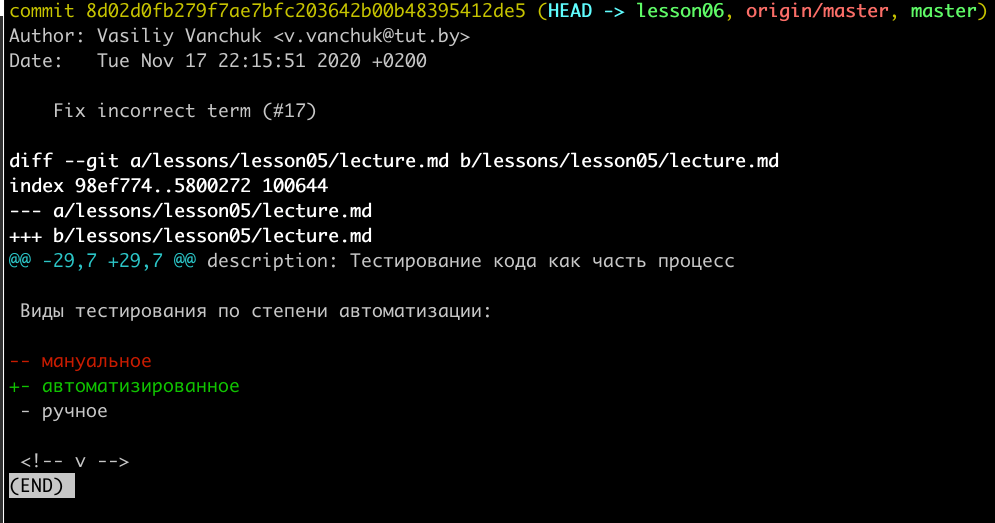

# OTUS

## Javascript Basic

<!--v-->

### Вопросы?

<!--s-->

## Использование СКВ

<!-- v -->

Код это файлы (в нашем случае текст)

Задачи:

- версионирование кода
- просмотр изменений (что поменялось между версиями)
- применение изменений (как применить изменения, сделанные другим человеком)

<!-- v -->

Частично задача решается современными редакторами

- [WebStorm](https://www.jetbrains.com/help/webstorm/local-history.html)
- [VSCode](https://marketplace.visualstudio.com/items?itemName=xyz.local-history)

<!-- v -->

[Система контроля версий](https://git-scm.com/book/ru/v2/%D0%92%D0%B2%D0%B5%D0%B4%D0%B5%D0%BD%D0%B8%D0%B5-%D0%9E-%D1%81%D0%B8%D1%81%D1%82%D0%B5%D0%BC%D0%B5-%D0%BA%D0%BE%D0%BD%D1%82%D1%80%D0%BE%D0%BB%D1%8F-%D0%B2%D0%B5%D1%80%D1%81%D0%B8%D0%B9) — это система, записывающая изменения в файл или набор файлов в течение времени и позволяющая вернуться позже к определённой версии.

<!-- v -->

Почему [Git](https://git-scm.com/book/ru/v2/%D0%92%D0%B2%D0%B5%D0%B4%D0%B5%D0%BD%D0%B8%D0%B5-%D0%9A%D1%80%D0%B0%D1%82%D0%BA%D0%B0%D1%8F-%D0%B8%D1%81%D1%82%D0%BE%D1%80%D0%B8%D1%8F-Git)?

- стандарт де-факто (вероятность встретить что-то другое очень мала)
- удобный инструмент (позволяет гибко делать очень разные вещи)
- позволяет работать без применения удаленного сервера

<!-- v -->

## Вопросы?

<!-- v -->

Для создания git репозитория нужно создать новую папку, и внутри нее выполнить команду `git init`.

При этом там появится директория `.git`, которая служит для хранения служебных данных git. И вам станут доступны остальные команды.

<!-- v -->

Немного о терминологии

<!-- v -->

**Коммит** - [слепок файловой системы на определенный момент](https://git-scm.com/book/ru/v2/%D0%92%D0%B2%D0%B5%D0%B4%D0%B5%D0%BD%D0%B8%D0%B5-%D0%9E%D1%81%D0%BD%D0%BE%D0%B2%D1%8B-Git).

Визуально же он представляет собой набор изменений

<!-- v -->

```bash
git show 8d02d0fb279f7ae7bfc203642b00b48395412de5
```



<!-- v -->

Атрибуты [коммита](https://github.com/vvscode/otus--javascript-basic/commit/8d02d0fb279f7ae7bfc203642b00b48395412de5):

- sha-hash
- автор
- комментарий
- указатель на родительский коммит

<!-- v -->

**Tag** / **Branch** - именованные указатели на коммит.

**Tag** - указатель на конкретный коммит.

**Branch** - последовательность коммитов. У этого списка есть `HEAD`, который указывает на последний коммит в ветке (в отличии от тега он не фиксированный)

<!-- v -->

**Merge** - [слияние двух веток в одну](https://github.com/vvscode/otus--javascript-basic/pull/1/files) (когда изменения из второй ветки переносятся в первую)

<!-- v -->

**Pull request** - [запрос переноса изменений](https://github.com/vvscode/otus--javascript-basic/pull/1/files) из одной ветки в другую (запрос на merge)

<!-- v -->

**Remote** - удаленный репозиторий, с которым идет обмен изменениями. Может быть папкой на локальном диске, на сетевом диске или на удаленном сервере. Может быть один или несколько.

Remote по умолчанию называют `origin`.

```bash
# Посмотреть список remote
git remote
# Посмотреть подробнее
git remote -v
# Добавить новый remote
git remote add new-remote-name https://github.com/vvscode/otus--javascript-basic.git
```

<!-- v -->

[**Github**](https://github.com):

- UI для git
- сервис централизованных репозиториев
- социальная сеть
- вспомогательные инструменты (CI, issues, projects, wiki, etc)

<!-- v -->

## Вопросы?

<!-- v -->

Как просмотреть историю коммитов?

([И как сделать это красиво](https://stackoverflow.com/questions/1057564/pretty-git-branch-graphs))

```bash
git log

git log -n 3

git log --all --graph --color --pretty=format:'%h^%C(white)%<(25,trunc)%an%C(reset)^%C(white)%<(31,trunc)%aD%C(reset)^%s%n^%C(dim white)%<(25,trunc)%ae%C(reset)^%>(31,trunc)%D%C(reset)%n'
```

<!-- v -->

Состояние git можно узнать при помощи

```bash
git status
```

<!-- v -->

4 состояния файла

- ignored (если файлы подходят под одну из масок в файле `.gitignore`)
- new / untracked
- staged
- committed

<!-- v -->

В коммит попадают только изменения из фазы `staged` (из индекса).

Для добавления файлов в индекс используется команда `git add`

```bash
# Просмотреть состояние
git status

# Добавить файл в индекс
git add file.js

# Удалить файлы из индекса
# все
git reset
# конкретный файл
git reset file.js
```

<!-- v -->

Для просмотра изменений, которые попадут в коммит можно использовать команду `git diff`

<!-- v -->

Для создания коммита используется команда `git commit`.

Особенность - при выполнении команды без параметров откроется редактор (по умолчанию - [`vim`](https://www.linux.org.ru/forum/general/15057697))

Можно сразу задавать сообщение коммита с помощью

```bash
git commit -m "My awesome message"
```

<!-- v -->

```bash
# Для создания веток используется команда
git checkout -b my-branch-name

# Для переключения на коммит (ветку)
git checkout some-branch-name
git checkout some-tag-name
git checkout 8d02d0fb279f7ae7bfc203642b00b48395412de5
```

<!-- v -->

## Вопросы?

<!-- v -->

### Как работать с ветками?

- [Удачная модель ветвления для Git](https://habr.com/ru/post/106912/)
- [Пожалуйста, перестаньте рекомендовать Git Flow](https://habr.com/ru/company/flant/blog/491320/)
- [GitHub Flow (ru)](https://habr.com/ru/post/346066/)
- [Gitlab Flow (ru)](https://habr.com/ru/company/intersystems/blog/354158/)

<!-- v -->

На курсе модель такая ([Github flow](https://habr.com/ru/post/346066/)):

- основная ветка `master` / `main`
- новое задание - от основной ветки создается ветка `a` (и от нее пуллреквест в основную)
- если до завершения задания вам нужно сделать другую задачу, которая не зависит от ветки `a` - от основной ветки вы создаете ветку `b` (и от нее пуллреквест в основную)
- если задача зависит от ветки `a` - вы создаете ветку `a1` от ветки `a` (и пуллреквест будет в ветку `a`)

<!-- v -->

### Когда делать коммит?

Когда вы достигли промежуточного (или конечного) результата или сделали осмысленный набор изменений. Делать коммиты "раз в день" или "когда закончу" - плохая практика.

<!-- v -->

### Что писать в сообщение коммита?

Что [и для чего] делает коммит.

- [Как писать сообщения коммитов в Git](https://medium.com/grisme/%D0%BA%D0%B0%D0%BA-%D0%BF%D0%B8%D1%81%D0%B0%D1%82%D1%8C-%D1%81%D0%BE%D0%BE%D0%B1%D1%89%D0%B5%D0%BD%D0%B8%D1%8F-%D0%BA%D0%BE%D0%BC%D0%BC%D0%B8%D1%82%D0%BE%D0%B2-%D0%B2-git-9ed19ebc5ebf)
- [Как оформлять коммиты, чтобы потом не было больно](https://habr.com/ru/company/Voximplant/blog/276695/)
- [Как следует писать комментарии к коммитам](https://habr.com/ru/post/416887/)
- [Общепринятые коммиты](https://www.conventionalcommits.org/ru/v1.0.0-beta.4/)
- [lolcommits](https://lolcommits.github.io/)

<!-- v -->

### Когда делать Pull Request?

Без разницы. Удобно делать его сразу, тогда всегда можно посмотреть изменения из рабочей ветки.

Если вы не хотите получать ревью - создайте `Draft` pull request (черновик).

<!-- v -->

### Что писать в Pull Request?

Что и зачем делается. Обычно это краткое описание задачи / проблемы. Иногда причины, почему выбран тот или иной подход.

Для этого описания [можно создать шаблон](https://docs.github.com/en/free-pro-team@latest/github/building-a-strong-community/creating-a-pull-request-template-for-your-repository) (один раз) и пользоваться готовой структурой при каждом создании.

<!-- v -->

## Вопросы?

<!-- v -->

### Что использовать для работы с git?

<!-- v -->

Варианты:

- консоль
  - [git](https://git-scm.com/downloads)
  - [github cli](https://cli.github.com/)
- UI
  - встроенный в редактор
  - отдельная программа (например [Source Tree](https://www.sourcetreeapp.com/) или [Github Desktop](https://desktop.github.com/))

<!-- v -->

Основные команды:

```bash
# Создать директорию
mkdir new-repo
# Перейти в репозиторий
cd new-repo
# Создать репозиторий
git init
# Создать файл
echo "Test" > 1.txt
# Посмотреть статус
git status
# Посмотреть diff
git diff
# Добавить файл в индекс
git add 1.txt
# Сделать коммит
git commit -m "Add 1.txt"
# Посмотреть лог
git log
# Создать новую ветку
git checkout -b new-branch
```

<!-- v -->

Основные команды для работы с удаленным сервером

```bash
# Просмотреть список remote
git remote -v
# Добавить remote
git remote add remotename git@github.com:vvscode/otus--javascript-basic.git
# Скачать ветки с remote
git fetch
git fetch remotename
# Скачать изменения из remote для текущей ветки
git pull
# Отправить изменения в remote
git push
git push remotename branch-name
```

<!-- v -->

## Вопросы?

<!-- s -->

## Github

<!-- v -->

Профиль:

- отображает основную информацию
- отображает список репозиториев
- отображает статистику
- можно сделать красивым ([1](https://www.youtube.com/watch?v=ECuqb5Tv9qI) и [2](https://github.com/abhisheknaiidu/awesome-github-profile-readme))

<!-- v -->

Репозитории:

- личные и организаций
- публичные и приватные

<!-- v -->

На странице репозитория отображается:

- статистика (stars, forks, followers, contributors)
- содержимое README файла
- дополнительные ссылки (проект, issues, wiki)

<!-- v -->

[Создание репозитория](https://github.com/new).

При добавлении remote обратите внимание на тип url (ssh/https).

<!-- v -->

Пример работы с репозиторием:

- создать репозиторий
- создать новую ветку
- внести изменения в ветку
- создать pull request
- вмержить пуллреквест
- создать новую ветку из основной на основе прошлых изменений
- сделать новый pull request

<!-- v -->

## Вопросы?

<!-- v -->

Практика:

- создать репозиторий (пустой)
- создать новую ветку
- в новой ветке создать файл README.md, добавить в него строчку '111' и сделать commit и push
- открыть пуллреквест с изменениями
- сбросить ссылку на pull request в чат

<!-- v -->

Практика:

- внести изменения в файл (поменять `111` на `222`)
- сделать коммит и отправить изменения в удаленную ветку (обновить pull request)
- сбросить ссылку в чат
- вмержить pull request
- локально переключиться на ветку по умолчанию
- подтянуть изменения с github
- создать новую ветку
- на основе изменений поменять `222` на `333`
- сделать коммит, push и открыть новый pull request
- сбросить ссылку в чат

<!-- v -->

## Вопросы?

<!-- s -->

## Автоматизация при работе с git

<!-- v -->

Git поддерживает [хуки](https://git-scm.com/book/ru/v2/%D0%9D%D0%B0%D1%81%D1%82%D1%80%D0%BE%D0%B9%D0%BA%D0%B0-Git-%D0%A5%D1%83%D0%BA%D0%B8-%D0%B2-Git).

Хуки бывают:

- клиентские
- серверные

Их можно использовать для:

- изменения кода
- формирования сообщений
- уведомления других программ о событиях

<!-- v -->

Что полезного можно сделать с хуками?

<!-- v -->

Серверные хуки доступны есть вы запускаете свой собственный [git сервер](https://git-scm.com/book/ru/v2/Git-%D0%BD%D0%B0-%D1%81%D0%B5%D1%80%D0%B2%D0%B5%D1%80%D0%B5-%D0%9D%D0%B0%D1%81%D1%82%D1%80%D0%B0%D0%B8%D0%B2%D0%B0%D0%B5%D0%BC-%D1%81%D0%B5%D1%80%D0%B2%D0%B5%D1%80). Но мы работаем с Github и он это делать не позволяет. Зато Github поддерживает [веб-хуки](https://docs.github.com/en/free-pro-team@latest/developers/webhooks-and-events/about-webhooks).

<!-- v -->

Это использовалось для интеграции с сторонними системами (например [CI](https://habr.com/ru/post/352282/)).

Тут есть варианты:

- Jenkins
- TeamCity
- TravisCI
- CircleCI
- GitlabCI
- GithubActions

<!-- v -->

Предпочтительнее использовать системы, которые поддерживают конфигурацию на уровне кода (TravisCI, CircleCI, GitlabCI, GithubActions)

<!-- v -->

Для работы с интеграциями на курсе мы будем использовать [GithubActions](https://docs.github.com/en/free-pro-team@latest/actions) ([краткое введение](https://habr.com/ru/company/microsoft/blog/481502/)).

Для подключения action нужно просто добавить [yml](https://ru.wikipedia.org/wiki/YAML) файл с нужной структурой.

Примеры файлов можно посмотреть [здесь](https://github.com/otus-js-student/js--game-of-life/tree/master/.github/workflows) и [здесь](https://github.com/vvscode/otus--javascript-basic/tree/master/.github/workflows).

<!-- v -->

## Вопросы?

<!-- v -->

Практика:

- в созданном репозитории создать новую ветку
- добавить туда [workflow для добавления комментария со ссылкой на codesandbox](https://github.com/otus-js-student/js--game-of-life/blob/master/.github/workflows/codesandbox-link-comment.yml)
- добавить в репозиторий файл [index.html](https://gist.github.com/vvscode/24df74ff0771e09bef53e40cba819c7a) с заголовком OTUS и выводом `alert`
- сделать commit, push, pull request
- убедиться что добавлен комментарий
- сбросить ссылку на pull request в чат

<!-- v -->

## Вопросы?

<!-- s -->

## Домашнее задание

<!-- v -->

Короткая вводная по запуску тестов локально:

```bash
# Перейти в директорию проекта (репозитория)

# Инициализировать проект
npm init -y

# Добавить node_modules в .gitignore
echo "node_modules" >> .gitignore

# Установить jest
npm install jest --save-dev

# Создать конфигурацию jest
npx jest --init

# Проверить работу тестов при помощи
npm run test
```

<!-- v -->

Для настроек Jest выберите следующую конфигурацию

```bash
✔ Would you like to use Typescript for the configuration file? … no
✔ Choose the test environment that will be used for testing › jsdom (browser-like)
✔ Do you want Jest to add coverage reports? … no
✔ Which provider should be used to instrument code for coverage? › v8
✔ Automatically clear mock calls and instances between every test? … yes
```

<!-- v -->

Вам нужно будет:

- создать репозиторий на гитхабе
- инициировать проект в репозитории
- решить предложенные задачи (разместив код и тесты в директории `src`)
- покрыть решение задач автоматическими тестами
- сделать коммит (а лучше несколько - по одному на задание)
- открыть пуллреквест
- прислать ссылку на пуллревест в чат с преподавателем"

<!-- v -->

Критерии оценки:

- создан репозиторий на гитхабе - 1
- создан npm-проект - 1
- Решены задания - 4
- Задания покрыты тестами - 4
- Сделан пуллреквест - 2
- Настроен хаски и линтеры - 1
- Настроен прогон тестов и линтеров на CI (и это видно в пуллреквесте) - 2

Задание считается принятым при 13 баллах

<!-- s -->

Дополнительные материалы:

- [Git Book(ru)](https://git-scm.com/book/ru/v2)
- [Git изнутри](https://habr.com/ru/post/468205/)
- [19 советов по повседневной работе с Git](https://habr.com/ru/company/mailru/blog/267595/)
- [Курс "Введение в Git"](https://ru.hexlet.io/courses/intro_to_git)
- [Скринкаст по Git](https://learn.javascript.ru/screencast/git)
- [Первоначальная настройка Git](https://hyperhost.ua/info/ru/pervonachalnaya-nastroyka-git)
