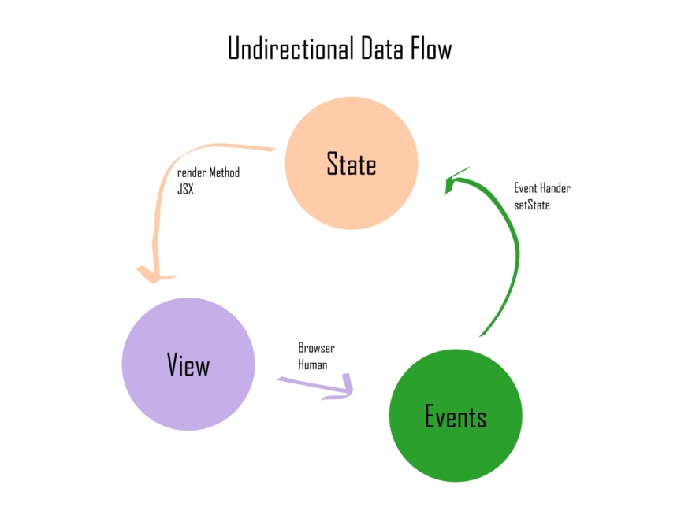

# OTUS

## Javascript Basic

<!-- v -->

Вопросы?

<!-- s -->

### [React.Component](https://ru.reactjs.org/docs/react-component.html)

<!-- v -->

1. [`setState`](https://github.com/facebook/react/blob/master/packages/react/src/ReactBaseClasses.js#L57)
1. [`forceUpdate`](https://github.com/facebook/react/blob/master/packages/react/src/ReactBaseClasses.js#L82)
1. [`render`](https://ru.reactjs.org/docs/react-component.html#render) - единственный обязательный метод в классовом компоненте

<!-- v -->

Общая схема методов, которые могут быть определены (и порядок вызова этих методов) отражен на [диаграмме](https://projects.wojtekmaj.pl/react-lifecycle-methods-diagram/).

<!-- v -->

С точки зрения TS [`React.Component` является generic с двумя (на самом деле тремя) параметрами](https://github.com/DefinitelyTyped/DefinitelyTyped/blob/master/types/react/index.d.ts#L433) - для описания `props` (какие свойства могут быть переданы в элемент) и `state` (какая структура описывает внутреннее состояние элемента).

<!-- v -->

Для описания пропсов компонентов может так же служить пакет [PropTypes](https://www.npmjs.com/package/proptypes) - но он не имеет особого смысла в TS-окружении

<!-- v -->

Вопросы?

<!-- v -->

[Практика](https://codesandbox.io/s/github/vvscode/otus--javascript-basic/tree/master/lessons/lesson44/code/counter-button):

реализовать кнопку-счетчик. Изначально кнопка отрисовывается со значением `0`. При каждом клике значение в кнопке должно увеличиваться на единицу.

<!-- v -->

Обратите внимание на метод [`setState`](https://ru.reactjs.org/docs/react-component.html#setstate) и его корректное использование, когда новое значение строится на основе прошлого.

<!-- v -->

Вопросы?

<!-- s -->

### Оговорка про функциональные компоненты с хуками (имеющими внутреннее состояние)

<!-- v -->

С версии [React 16.8](https://ru.reactjs.org/blog/2019/02/06/react-v16.8.0.html) поддерживаются функциональные компоненты, которые могут иметь [состояние и реализовывать некоторые другие возможности классовых компонентов](https://ru.reactjs.org/docs/hooks-intro.html).

<!-- v -->

```tsx [1-30]
import { useState } from "react";

export default function App() {
  const [counter, setCounter] = useState(0);
  return (
    <button onClick={() => setCounter((counter) => counter + 1)}>
      {counter}
    </button>
  );
}
```

<!-- v -->

> [Хуки решают множество, казалось бы, несвязанных между собой, проблем в React, с которыми мы сталкивались в течение пяти лет написания и поддержки десятков тысяч компонентов](https://ru.reactjs.org/docs/hooks-intro.html#motivation)

<!-- v -->

- [Трудно повторно использовать логику состояний между компонентами](https://ru.reactjs.org/docs/hooks-intro.html#its-hard-to-reuse-stateful-logic-between-components)
- [Сложные компоненты становятся трудными для понимания](https://ru.reactjs.org/docs/hooks-intro.html#complex-components-become-hard-to-understand)
- [Классы путают как людей, так и машины](https://ru.reactjs.org/docs/hooks-intro.html#classes-confuse-both-people-and-machines)

<!-- v -->

[FAQ](https://ru.reactjs.org/docs/hooks-faq.html):

> Хуки не изменили фундаментальную логику React, поэтому ваши знания компонентов, пропсов и нисходящего потока данных остаются актуальными.

> Однако, хуки — не самая простая часть React.

<!-- v -->

Вопросы?

<!-- s -->

### Smart and dumb components

<!-- v -->

Один из паттернов (некоторые его называют устаревшим, но это все еще реализация разделения ответственности) - разделение компонентов на:

- отвечающие за внешний вид и отображение
- отвечающие за логику (в том числе загрузку данных)

<!-- v -->

Презентационные компоненты (глупые компоненты):

- содержат разметку и логику представления
- (почти) не содержат своего собственного состояния
- легко могут быть переиспользованы (в идеале являются отображением props на UI)

<!-- v -->

Компоненты-контейнеры (умные компоненты):

- отвечают за загрузку данных (или отправку команд на такую загрузку)
- отвечают за логику взаимодействия с пользователем (а иногда не только с ним)
- в `render` делают композицию презентационных компонентов (передавая им данные через props)

<!-- v -->

Но т.к. пользователь взаимодействует как раз с презентационной частью, дополнением идеи является паттерн ["контролируемый ввод" (state hoisting + controlled input = unidirectional data flow)](https://reactpatterns.com/#controlled-input)

<!-- v -->



<!-- v -->

```tsx [1-30]
function CounterButton({
  value,
  inc,
  dec,
}: {
  value: number;
  inc: () => void;
  dec: () => void;
}) {
  return (
    <>
      <button onClick={dec}>-</button>
      {value}
      <button onClick={inc}>+</button>
    </>
  );
}
```

<!-- v -->

```tsx [1-30]
export class Counter extends React.Component<{}, { value: number }> {
  state = {
    value: 5,
  };

  inc = () =>
    this.setState((state) => ({
      value: state.value + 1,
    }));

  dec = () =>
    this.setState((state) => ({
      value: state.value - 1,
    }));

  render() {
    return (
      <CounterButton value={this.state.value} inc={this.inc} dec={this.dec} />
    );
  }
}
```

<!-- v -->

[Sandbox](https://codesandbox.io/s/github/vvscode/otus--javascript-basic/tree/master/lessons/lesson44/code/controlled-counter)

<!-- v -->

Вопросы?

<!-- s -->

### Домашнее задание

<!-- v -->

Необходимо:

1. создать и настроить проект
2. настроить [storybook](https://storybook.js.org/docs/react/get-started/introduction)
3. настроить тесты с [loki](https://loki.js.org/)
4. создать глупые компоненты (модификация поведения и передача параметров должна делаться через props):

- заголовок (с поддержкой уровней)
- параграф текста (с разными стилями - обычный, цитата, полужирный)
- пробельный блок (с горизонтальной линией)
- схлопывающийся блок (может сворачиваться в заголовок или показывать контент)
- картинка (с вариантами обтекания)
- колонки (с переменным числом колонок)

<!--v -->

5. создать умный компонент, который запрашивает у пользователя данные и выводит их на страницу - в цикле (пока ответ не будет пустой) спрашивает имя компонента (из списка выше), какие ему нужны свойства (в зависимости от компонента) (можно взять простейшую реализацию с `prompt`)
6. опубликовать storybook на github pages
7. подготовить работу с сдаче (покрытие кода от 60%, использовать [RTL](https://testing-library.com/docs/react-testing-library/))
8. сделать ревью 2 других работ
9. сбросить ссылку на PR, опубликованный проект и рассмотренные пуллреквесты в част с преподавателем

<!-- v -->

Вопросы?

<!-- s -->

### Дополнительные материалы

1. [Умные и глупые компоненты React](https://habr.com/ru/post/266559/)
1. [Тупые и умные компоненты](https://habr.com/ru/company/epam_systems/blog/519856/)
1. [Presentational and Container Components](https://medium.com/@dan_abramov/smart-and-dumb-components-7ca2f9a7c7d0)
1. [Контейнеры и компоненты](https://max-frontend.gitbook.io/redux-course-ru-v2/sozdanie/konteineri-i-komponenti)
1. [Container component](https://reactpatterns.com/#container-component)
