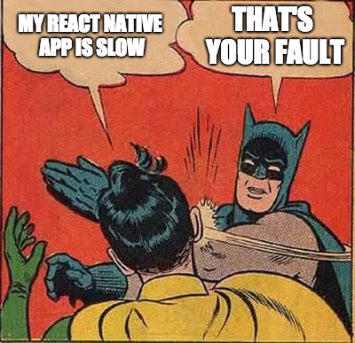
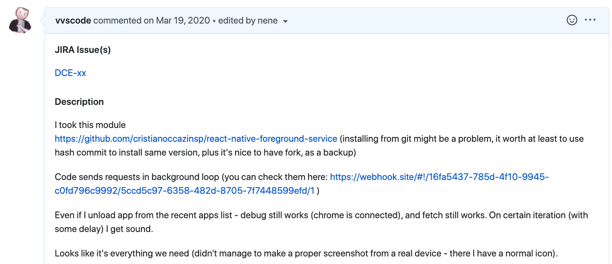
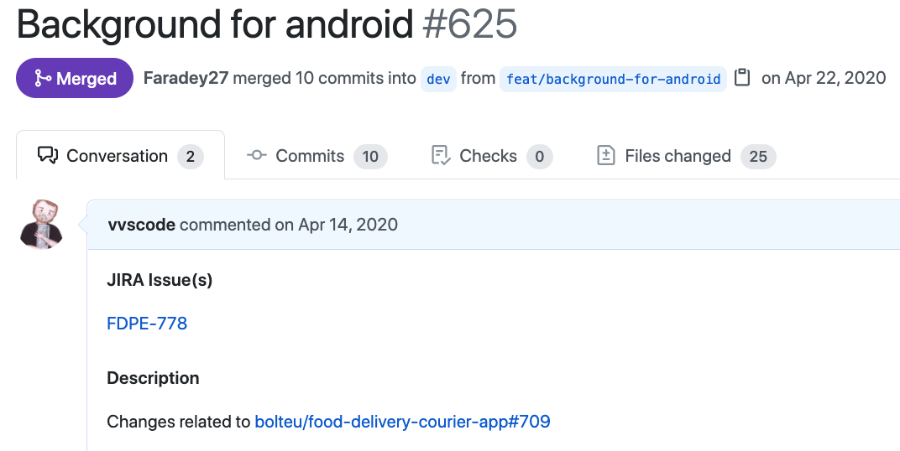
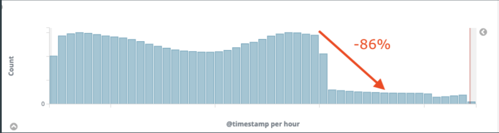

### Два слова обо мне

<!-- v  -->

#### Василий Ванчук

<!-- v -->

Я работаю с Javascript с 2012

<!-- v -->

Мой текущий проект - это много React Native

<!-- v -->

Конкретно я занимаюсь приложение для курьеров, 

в сервисе доставки

<!-- v -->

В фоне приложения на React Native засыпают 

(и умирают)

<!-- v -->

Главная проблема - "прожорливые" приложения убиваются первыми

<!-- v -->

Первым делом мы провели оптимизации

<!-- v -->

Но это не дает гарантий

<!-- v -->

React Native на половину Native

<!-- v -->

Когда знаешь что искать, жить становится легче

<!-- v -->

Среднее время онлайн увеличилось на 12%

<!-- v -->

Ура, товарищи!

<!-- v -->

Поделился с коллегами за кофе

<!-- v -->

И решил отсыпать им счастья

<!-- v -->

Прошло полгода

<!-- v -->

Пошли жалобы на производительность приложения у коллег

<!-- v -->

Немного технических деталей

<!-- v -->

Дьявол кроется в мелочах

<!-- v -->

Когда пользователь делал это

<!-- v -->

На самом деле происходило

<!-- v -->

На помощь пришел синглтон

<!-- v -->

В цифрах:

- число запросов снизилось на 86%
- потребление памяти снизилось с 800 Мб до 280 Мб

<!-- v -->

Выводы?

<!-- v -->

А мой коллега сделал про это доклад на HolyJS =)
