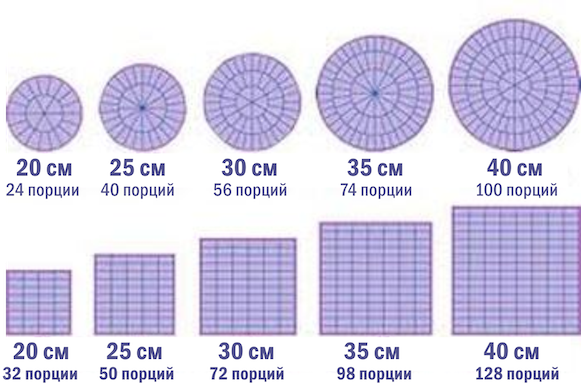

# OTUS

## Javascript Basic

<!--v-->

### Вопросы?

<!-- s -->

## ООП

<!-- v -->

**Объектно-ориенти́рованное программирование (ООП)** — методология программирования, основанная на представлении программы в виде совокупности объектов

<!-- v -->

### Disclaimer [(i)](https://habr.com/ru/post/451982/)

- ООП может объясняться по разному
- Мы не рассматриваем паттерны ООП (но при этом мы к ним отсылаем)
- Мы почти не говорим про принципы ООП

<!-- v -->

[Кошелек Миллера](https://ru.wikipedia.org/wiki/%D0%9C%D0%B0%D0%B3%D0%B8%D1%87%D0%B5%D1%81%D0%BA%D0%BE%D0%B5_%D1%87%D0%B8%D1%81%D0%BB%D0%BE_%D1%81%D0%B5%D0%BC%D1%8C_%D0%BF%D0%BB%D1%8E%D1%81-%D0%BC%D0%B8%D0%BD%D1%83%D1%81_%D0%B4%D0%B2%D0%B0)

<!-- v -->

Главное для чего мы будем использовать ООП - [Абстракция](https://ru.wikipedia.org/wiki/%D0%90%D0%B1%D1%81%D1%82%D1%80%D0%B0%D0%BA%D1%86%D0%B8%D1%8F_%D0%B4%D0%B0%D0%BD%D0%BD%D1%8B%D1%85)([!](https://ru.wikipedia.org/wiki/%D0%90%D0%B1%D1%81%D1%82%D1%80%D0%B0%D0%BA%D1%86%D0%B8%D1%8F)).

Абстракция позволяет обойти ограничение Миллера, позволяя оперировать более крупными единицами информации.

<!-- v -->

В первом приближении зачатком абстракции может быть группировка данных в структуры.

```ts [1-30]
const nameA = "Bob";
const ageA = 17;

const nameB = "Sam";
const ageB = 28;

//

type Person = {
  name: string;
  age: number;
};

const bob: Person = {
  name: "Bob",
  age: 17,
};

const sam: Person = {
  name: "Sam",
  age: 18,
};
```

<!-- v -->

Продолжением является вычленение кода, который работает с данными, и присоединения этого кода к сущностям. Чтобы они знали **как** работать, с относящимися к ним данными

<!-- v -->

```ts [1-30]
type Greetable = {
  getGreetPhrase(): string;
};

const bob: Person & Greetable = {
  name: "Bob",
  age: 17,
  getGreetPhrase() {
    return this.age > 17 ? "Good morning" : "Hi";
  },
};
```

<!-- v -->

Объект - совокупность данных и реализация поведения (функций, для работы с данными объекта).

<!-- v -->

В Javascript мы имеем возможность создавать новые объекты, на основе других объектов (прототипное наследование).

```ts [1-30]
type GreetablePerson = Person & Greetable;

const basePerson: GreetablePerson = {
  name: "Noname",
  age: 0,
  getGreetPhrase() {
    return this.age > 17 ? "Good morning" : "Hi";
  },
};

const bob: GreetablePerson = Object.create(basePerson, {
  name: { value: "Bob" },
  age: { value: 17 },
});

const sam: GreetablePerson = Object.create(basePerson);
sam.name = "Sam";
sam.age = 20;
```

<!-- v -->

Другой подход к этому вопросу - создание новых объектов на основе шаблонов (использование конструкторов или классов)

```ts [1-30]
type Person = {
  name: string;
  age: number;
};

type Greetable = {
  getGreetPhrase(): string;
};

class GreetablePerson implements Person, Greetable {
  constructor(public name: string = "Noname", public age: number = 0) {}

  getGreetPhrase() {
    return this.age > 17 ? "Good morning" : "Hi";
  }
}

const bob = new GreetablePerson("Bob", 17);
const sam = new GreetablePerson("Sam");
```

<!-- v -->

При этом, если мы хотим добавить в шаблонную сущность новые свойства:

- Для объектов - мы можем просто добавить новый элемент в цепочку прототипов (тот же `Object.create`)

- Для классов - мы можем использовать механизм наследование, через расширение классов (`class A extends B {}`)

<!-- v -->

### Вопросы?

<!-- v -->

Нет "единственно верного" способа организовывать объекты и классы.

Ключевой критерий - упрощение [**чтения и понимания**](https://habr.com/ru/post/354750/) кода.

<!-- v -->



<!-- v -->

Вы уже оперировали объектами в том или ином виде

```js [1-30]
let button = document.createElement("button");
button.innerHTML = "add";
button.addEventListener("click", () => {
  alert("Hi");
});
// ...
input.addEventListener("keyup", () => {
  if (input.value !== "") {
    el.appendChild(button);
  } else {
    el.removeChild(button);
  }
});
```

<!-- v -->

Самый простой подход к выделению сущностей - описать, что вы хотите сделать, и обратить внимание на то, какими терминами вы пользуетесь для описания процесса.

Эти термины могут у разных людей быть разными для одного и того же процесса.

<!-- v -->

Процесс покупки шоколадки в магазине:

- взять с **полки** понравившуюся **шоколадку**
- положить ее в **корзину**
- предъявить ее на **кассе**
- достать из **кошелька** подходящую **купюру** и отдать ее **кассиру**

<!-- v -->

При этом, в программе мы реализуем некоторые приближенные модели процессов, поэтому некоторые сущности могут оказаться для нас лишними (в данной конкретной реализации).

Например _кассир_, _кошелек_, _полка_

<!-- v -->

### Вопросы?

<!-- s -->

### Game of Life

<!-- v -->

### Вопросы?

<!-- s -->

### Опрос о занятии

<!-- s -->

Дополнительные материалы:

- [Фундаментальные принципы объектно-ориентированного программирования на JavaScript](https://tproger.ru/translations/oop-js-fundamentals/)
- [Антипаттерны в программировании и проектировании архитектуры](https://bool.dev/blog/detail/antipatterny-v-programmirovanii-i-proektirovanii-arkhitektury)
- Что такое антипаттерны? Разбираем примеры [1](https://javarush.ru/groups/posts/2622-chto-takoe-antipatternih-razbiraem-primerih-chastjh-1) и [2](https://javarush.ru/groups/posts/2624-chto-takoe-antipatternih-razbiraem-primerih-chastjh-2)
- [YT: Основы ООП - Иван Бибилов](https://www.youtube.com/watch?v=t8zwdpkSRWs)
- [YT: САМЫЕ ЧАСТЫЕ ЗАБЛУЖДЕНИЯ ООП](https://www.youtube.com/watch?v=BHNt1fcg8iw)
- [YT: Антипаттерны ООП (часть 1) c примерами на JavaScript](https://www.youtube.com/watch?v=9d5TG1VsLeU)
- [ФП против ООП](https://habr.com/ru/post/474518/)
