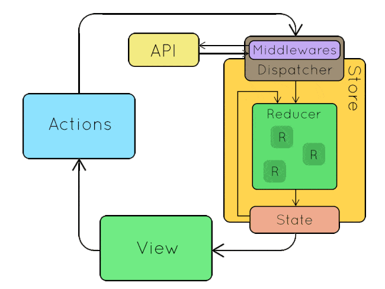

# OTUS

## Javascript Basic

<!-- v -->

## Вопросы?

<!-- v -->

Какую задачу решает паттерн `Наблюдатель`?

<!-- v -->

Какое API у `EventEmitter` интерфейса?

<!-- v -->

Какую задачу решает паттерн `Посредник` ?

<!-- v -->

Чем `EventBus` отличается от `EventTarget` ?

<!-- s -->

### Управление состоянием приложения, разработка redux

<!-- s -->

### Сначала разберемся с задачей

<!-- v -->

**Состояние приложения** - набор всех переменных/параметров/свойств, которые определяют внешний вид и поведение приложения в каждый конкретный момент времени.

Например:

- какая страница сейчас открыта
- какой элемент сейчас активен
- что пользователь ввел в поле поиска

<!-- v -->

На уровне кода `состояние` - это совокупность переменных и свойств объектов.

<!-- v -->

Где находится состояние в системе, построенной на основе `EventBus` ?


<!-- v -->

В такой системе состояние оказывается `размазанным` по модулям. Это подходит для приложений, которые являются набором независимых блоков. Но при этом отображение одного модуля, не может использовать данные из другого модуля (т.к. модули друг о друге не знают).

<!-- v -->

Поэтому появилась идея "централизованного хранилища" - единого объекта, который хранит в себе все состояние приложения, и обладает всей информацией, которая влияет на приложение.

<!-- v -->

Самым базовым вариантом реализации является использование глобального объекта и глобальных переменных, которые доступны в любой части приложения.

<!-- v -->

Проблема с таким подходом:

- кто угодно может вносить неконтролируемые изменения
- сложно отследить факт изменения переменных состояния (вспоминаем про обновление представления)

<!-- v -->

### Вопросы?

<!-- s -->

### Redux

<!-- v -->

[Мотивация:](https://rajdee.gitbooks.io/redux-in-russian/content/docs/introduction/Motivation.html)

Redux пытается сделать изменения состояния предсказуемыми, путем введения некоторых ограничений на то, как и когда могут произойти обновления. Эти ограничения отражены в трех принципах Redux.

<!-- v -->

### [Redux - 3 принципа](https://rajdee.gitbooks.io/redux-in-russian/content/docs/introduction/ThreePrinciples.html)

- **Единственный источник правды**  
  Состояние всего вашего приложения сохранено в дереве объектов внутри одного стора.
- **Состояние только для чтения**  
  Единственный способ изменить состояние — это применить экшен — объект, который описывает, что случится.
- **Мутации написаны, как чистые функции**  
  Для определения того, как дерево состояния будет трансформировано экшенами, вы пишете чистые редюсеры.

<!-- v -->

### Вопросы?

<!-- v -->

## Redux - Термины

<!-- v -->

### State

Объект в котором хранятся данные приложения

```ts
interface GameOfLifeState {
  field: boolean[][];
  isRunning: boolean;
  speed: number;
}
```

<!-- v -->

### [Action](https://rajdee.gitbooks.io/redux-in-russian/content/docs/basics/Actions.html)

Объект, который описывает, что происходит в системе

```ts
interface Action<T = any> {
  type: T;
  payload?: any;
}
```

<!-- v -->

### Action Creator (Генератор событий)

Обычная функция, которая возвращает объект `action`. Нужна чтобы писать меньше кода и делать меньше ошибок.

```ts
function changeCellState(x: number, y: number) {
  return {
    type: "CHANGE_CELL_STATE",
    payload: { x, y },
  };
}
```

<!-- v -->

### [Reducer](https://rajdee.gitbooks.io/redux-in-russian/content/docs/basics/Reducers.html)

Функция (чистая), которая возвращает новый state как реакцию на action

```ts
type Reducer<S = any, A extends Action = AnyAction> = (
  state: S | undefined,
  action: A
) => S;
```

<!-- v -->

### Reducer

```ts
function reducer(state: GameOfLifeState, action): GameOfLifeState {
  switch (action.type) {
    case "START_GAME": {
      return {
        ...state,
        isRunning: true,
      };
    }
    case "STOP_GAME": {
      return {
        ...state,
        isRunning: false,
      };
    }
    // ...
    default: {
      return state;
    }
  }
}
```

<!-- v -->

### [Store](https://rajdee.gitbooks.io/redux-in-russian/content/docs/basics/Store.html)

Объект, который соединяет эти части вместе:

- содержит состояние приложения (application state);
- предоставляет доступ к состоянию с помощью getState();
- предоставляет возможность обновления состояния с помощью dispatch(action);
- обрабатывает отмену регистрации слушателей с помощью функции, возвращаемой subscribe(listener).

<!-- v -->


<!-- v -->

### Вопросы?

<!-- s -->

[Практика](https://codesandbox.io/s/github/vvscode/otus--javascript-basic/tree/master/lessons/lesson34/code/reduxBasic)

<!-- v -->

### Вопросы?

<!-- s -->

### Это еще не все

<!-- v -->

### [Middlewares](https://rajdee.gitbooks.io/redux-in-russian/content/docs/advanced/Middleware.html)

Предоставляют стороннюю точку расширения, между отправкой экшена и моментом, когда этот экшен достигает редюсера. Люди используют Redux-мидлвары для логирования, сообщения об ошибках, общения с асинхронным API, роутинга и т.д.

<!-- v -->



<!-- v -->

### [combineReducers](https://rajdee.gitbooks.io/redux-in-russian/content/docs/recipes/reducers/UsingCombineReducers.html)

<!-- v -->

```ts
type UsersState = {
  name: string;
  score: number;
}[];

const defaultUsersState = [];

function usersReducer(
  state: UsersState = defaultUsersState,
  action: Action
): UsersState {
  switch (action.type) {
    case "ADD_USER":
      return [...state, action.payload];
    default:
      return state;
  }
}
```

<!-- v -->

```ts
interface State {
  users: // ... <- usersReducer
  gameField: // ... <- gameFieldReducer
}
```

<!-- v -->

```ts
type UsersState = {
  name: string;
  score: number;
}[];

const defaultUsersState = [];

function usersReducer(
  state: UsersState = defaultUsersState,
  action: Action
): UsersState {
  switch (action.type) {
    case "ADD_USER":
      return [...state, action.payload];
    default:
      return state;
  }
}
```

<!-- v -->

```ts
const reducer = combineReducers({
  users: usersReducer,
  gameField: gameFieldReducer,
});
```

<!-- v -->

```ts
const reducer = combineReducers({
  users: usersReducer,
  gameField: gameFieldReducer,
});
```

<!-- v -->

Превращает объект, значения которого являются разными функциями-reducer, в единую функцию reducer. Он будет вызывать каждый дочерний reducer и собирать их результаты
в единый объект состояния, ключи которого соответствуют ключам переданных дочерних reducer.

<!-- v -->

Условно тип можно было бы описать как

```ts
type CombineReducer<ReducersConfig = any, Action = { type: any }> = (config: {
  [key in keyof ReducersConfig]: (
    state: ReducersConfig[key] | undefined,
    action: Action
  ) => ReducersConfig[key];
}) => (
  state:
    | {
        [key in keyof ReducersConfig]: ReducersConfig[key];
      }
    | undefined,
  action: Action
) => {
  [key in keyof ReducersConfig]: ReducersConfig[key];
};
```

<!-- v -->

[Практика](https://codesandbox.io/s/github/vvscode/otus--javascript-basic/tree/master/lessons/lesson34/code/combineReducers)

<!-- v -->

### Вопросы?

<!-- s -->

### [Домашнее задание](./homework.md)

<!-- s -->

Дополнительные материалы:

- [Изучаем Redux и пишем свой Mini-Redux](https://stepansuvorov.com/blog/2017/05/learn-redux/)
- [Изучаем Redux на примере создания мини-Redux](https://medium.com/devschacht/jakob-lind-learn-redux-by-coding-a-mini-redux-d1a58e830514)
- [Описание концепта Middleware](https://rajdee.gitbooks.io/redux-in-russian/content/docs/advanced/Middleware.html)

<!-- s -->

### Опрос о занятии
