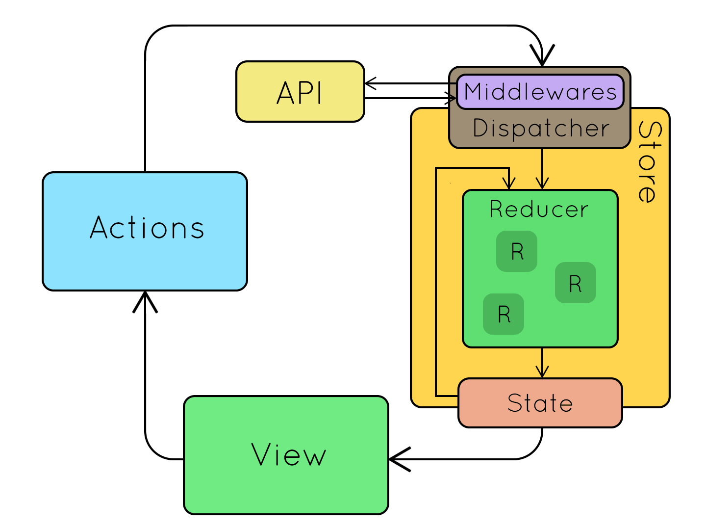

# OTUS

## Javascript Basic

<!-- v -->

### Вопросы?

<!-- v -->

Принципы redux?

<!-- v -->

Что такое редьюсер?

<!-- v -->

Что такое action?

<!-- v -->

Что такое action creator (генератор action)?

<!-- v -->

Какой API у store?

<!-- v -->

Какой API у middleware?

<!-- s -->

### Пакет [Redux](https://redux.js.org/)

<!-- v -->

В реальных проектах берут готовую реализацию паттерна.

Для Javascript ее можно найти на [npmjs.com](https://www.npmjs.com/package/redux)

<!-- v -->

### [Высокоуровневые экспорты](https://rajdee.gitbooks.io/redux-in-russian/content/docs/api/)

- `createStore(reducer, [preloadedState], [enhancer])`
- `combineReducers(reducers)`
- `applyMiddleware(...middlewares)`
- `bindActionCreators(actionCreators, dispatch)`
- `compose(...functions)`

<!-- v -->

### API стора Store

- getState()
- dispatch(action)
- subscribe(listener)
- replaceReducer(nextReducer)

<!-- v -->

Паттерн реализован так же как было разобрано на прошлом занятии. Только в прошлом мы смотрели упрощенный API (без некоторых методов).

<!-- v -->

### Вопросы?

<!-- s -->

### Асинхронный код в контексте redux

<!-- v -->

```js [1-30
const getStarredRepos = (username: string) => {
  return fetch(`https://api.github.com/users/${username}/starred`);
};
```

<!-- v -->

```js [1-30]
const getStarredRepos = (username: string) => {
  return fetch(`https://api.github.com/users/${username}/starred`).then(
    (data) => saveData(data)
  );
};
```

<!-- v -->

```js [1-30]
const getStarredRepos = (username: string) => {
  return fetch(`https://api.github.com/users/${username}/starred`)
    .then((data) => saveData(data))
    .catch((error) => showError(error));
};
```

<!-- v -->

```js [1-30]
const getStarredRepos = (username: string) => {
  saveIsLoading();

  return fetch(`https://api.github.com/users/${username}/starred`)
    .then((data) => saveData(data))
    .catch((error) => showError(error));
};
```

<!-- v -->

```js [1-30]
const getStarredRepos = (username: string) => {
  dispatch({ type: "LOADING" });

  return fetch(`https://api.github.com/users/${username}/starred`)
    .then((data) => dispatch({ type: "SUCCESS", data }))
    .catch((error) => dispatch({ type: "ERROR", error }));
};
```

<!-- v -->

```js [1-30]
const reducer = (state = { isLoading: false }, action) => {
  switch (action.type) {
    case "LOADING":
      return { ...state, isLoading: true };
    case "SUCCESS":
      return { ...state, isLoading: false, data: action.data, error: null };
    case "ERROR":
      return { ...state, isLoading: false, data: null, error: action.error };
    default:
      return state;
  }
};
```

<!-- v -->

```js [1-30]
const getStarredReposForCurrentUser = () => {
  const username = getCurrentUser(state).username;

  dispatch({ type: "LOADING" });

  return fetch(`https://api.github.com/users/${username}/starred`)
    .then((data) => dispatch({ type: "SUCCESS", data }))
    .catch((error) => dispatch({ type: "ERROR", error }));
};
```

<!-- v -->

Вопросы?

<!-- v -->

[Практика](https://codesandbox.io/s/github/vvscode/otus--javascript-basic/tree/master/lessons/lesson38/code/reduxDataLoading)

При клике на кнопку:

- отправьте событие `loading`
- дождидесь получения данных и отправьте событие `success`
- в случае ошибки отправьте событие `error`

<!-- s -->

### Redux Thunk

<!-- v -->

Thunk - это отложенное вычисление

```js [1-30]
const think = 42 + 666;

const thunk = () => 42 + 666;

const think2 = thunk();
```

<!-- v -->

```js [1-30]
// Применительно к actions
const think = dispatch({ type: "ADD", value: 666 });

const thunk = () => dispatch({ type: "ADD", value: 666 });
```

<!-- v -->

<!-- eslint-skip -->

```js [1-30]
// если избавиться от внешних зависимостей и передавать их параметрами
const thunk = (dispatch) => dispatch({ type: "ADD", value: 666 });

const thunk = (dispatch, getState) => dispatch({ type: "ADD", value: 666 });
```

<!-- v -->

```js [1-30]
// Как dispatch может быть устроен внутри
const dispatch = (action) => {
  const newState = rootReducer(store.getState(), action);
  store.setState(newState);
};
```

<!-- v -->

```js [1-30]
// а если бы мы хотели поддерживать thunk
const dispatch = (action) => {
  if (typeof action === "function") {
    action(dispatch, store.getState);
  }

  const newState = rootReducer(store.getState(), action);
  store.setState(newState);
};
```

<!-- v -->

```js [1-30]
// think
const username = getCurrentUser(state).username;

dispatch({ type: "LOADING" });

fetch(`https://api.github.com/users/${username}/starred`)
  .then((data) => dispatch({ type: "SUCCESS", data }))
  .catch((error) => dispatch({ type: "ERROR", error }));
```

<!-- v -->

```js [1-30]
// thunk
const getStarredReposForCurrentUser = () => {
  const username = getCurrentUser(state).username;

  dispatch({ type: "LOADING" });

  return fetch(`https://api.github.com/users/${username}/starred`)
    .then((data) => dispatch({ type: "SUCCESS", data }))
    .catch((error) => dispatch({ type: "ERROR", error }));
};
```

<!-- v -->

```js [1-30]
// thunk (with dependencies)
const getStarredReposForCurrentUser = (dispatch, getState) => {
  const username = getCurrentUser(getState()).username;

  dispatch({ type: "LOADING" });

  return fetch(`https://api.github.com/users/${username}/starred`)
    .then((data) => dispatch({ type: "SUCCESS", data }))
    .catch((error) => dispatch({ type: "ERROR", error }));
};
```

<!-- v -->

Напомню, мы обычно используем не actions напрямую, а action creators

```ts
// не
dispatch({ type: "USERS_LOADED", payload: list });

// а
dispatch(usersLoaded(list));

// где
const userLoaded = (payload) => ({
  type: "USERS_LOADED",
  payload,
});
```

<!-- v -->

```js [1-30]
// thunk action creator
const getStarredReposForCurrentUser = () => (dispatch, getState) => {
  const username = getCurrentUser(getState()).username;

  dispatch({ type: "LOADING" });

  return fetch(`https://api.github.com/users/${username}/starred`)
    .then((data) => dispatch({ type: "SUCCESS", data }))
    .catch((error) => dispatch({ type: "ERROR", error }));
};

dispatch(getStarredReposForCurrentUser());
```

<!-- v -->

### Вопросы?

<!-- s -->

### Middleware

<!-- v -->

```js [1-30]
const middleware = (middlewareApi) => (next) => (action) => {
  // your code
};
```

<!-- v -->

```ts [1-30]
type MiddlewareApi = {
  dispatch: Dispatch;
  getState: () => State;
};

const middleware = (middlewareApi: MiddlewareApi) => (next) => (action) => {
  // your code
};
```

<!-- v -->

```ts [1-30]
const middleware =
  (middlewareApi: MiddlewareApi) =>
  (next: (action: AnyAction) => AnyAction) =>
  (action) => {
    // your code
  };
```

<!-- v -->

```ts [1-30]
const middleware =
  (middlewareApi: MiddlewareApi) =>
  (next: (action: AnyAction) => AnyAction) =>
  (action: AnyAction): AnyAction => {
    // your code
  };
```

<!-- v -->

```ts [1-30]
const middleware: Middleware =
  ({ dispatch, getState }) =>
  (next) =>
  (action) => {
    // Сделать что-то до дальнейшей цепочки
    const resultAction = next(action);
    // Сделать что-то после дальнейшей цепочки
    return resultAction;
  };
```

<!-- v -->

```ts [1-30]
const middleware: Middleware =
  ({ dispatch, getState }) =>
  (next) =>
  (action) => {
    const resultAction = next(action);

    if (action.type === "BUY_BUTTON_CLICK") {
      const state = getState();
      sendAnalytics("buy", { user: state.currentUser });
    }

    return resultAction;
  };
```

<!-- v -->



<!-- v -->

Задачи, для middleware:

- Логирование
- Аналитика
- Devtools
- Обработка actions
- Цепочки actions

<!-- v -->

### Вопросы?

<!-- v -->

[Практика](https://codesandbox.io/s/github/vvscode/otus--javascript-basic/tree/master/lessons/lesson38/code/reduxDataLoading)

В файле `logger.ts` раскомментируйте объявленную там middleware

- Залогируйте состояние до экшена
- Пустите экшен по цепочке дальше
- Залогируйте состояние после
- Верните экшен полученный из цепочки

<!-- v -->

### Вопросы?

<!-- s -->

### Снова к thunk

<!-- v -->

```js [1-30]
// Пропатченый dispatch для поддержки thunk
const dispatch = (action) => {
  if (typeof action === "function") {
    action(dispatch, store.getState);
  }

  const newState = rootReducer(store.getState(), action);
  store.setState(newState);
};
```

Напомню, что эта [трагическая история описана в документации](https://rajdee.gitbooks.io/redux-in-russian/content/docs/advanced/Middleware.html)

<!-- v -->

```js [1-30]
/**
 * Позволяет вам отправлять функцию вместо экшена.
 * Функция будет принимать `dispatch` и `getState` в качестве аргументов.
 *
 * Полезно для раннего выхода (условия над `getState()`), а также для
 * асинхронного потока управления (может `dispatch()` что-то другое)
 *
 * `dispatch` будет возвращать значение отправляемой функции.
 */
const thunk = (store) => (next) => (action) =>
  typeof action === "function"
    ? action(store.dispatch, store.getState)
    : next(action);
```

<!-- v -->

[Redux-thunk](https://github.com/reduxjs/redux-thunk)

и как эта функция выглядит в [исходном коде](https://github.com/reduxjs/redux-thunk/blob/master/src/index.js)

<!-- v -->

[Как миддлвары подключаются к store](https://redux.js.org/api/applymiddleware):

```js [1-30]
import { createStore, applyMiddleware } from "redux";
import todos from "./reducers";

function logger({ getState }) {
  return (next) => (action) => {
    console.log("will dispatch", action);

    // Call the next dispatch method in the middleware chain.
    const returnValue = next(action);

    console.log("state after dispatch", getState());

    // This will likely be the action itself, unless
    // a middleware further in chain changed it.
    return returnValue;
  };
}

const store = createStore(todos, ["Use Redux"], applyMiddleware(logger));

store.dispatch({
  type: "ADD_TODO",
  text: "Understand the middleware",
});
```

<!-- v -->

### Вопросы?

<!-- v -->

[Практика](https://codesandbox.io/s/github/vvscode/otus--javascript-basic/tree/master/lessons/lesson38/code/reduxDataLoading)

- установите пакет redux-thunk
- подключите миддлвару redux-thunk к вашему store
- превратите функцию загрузки данных в thunk-action

<!-- s -->

### Домашнее задание

<!-- v -->

Необходимо:

- создать и настроить проект в новом репозитории

- реализовать приложение чат - которое позволяет отправлять сообщения и отображает входящие сообщения из канала в firebase.

  - создать Redux структуру для приложения чат
  - создать UI для приложения
  - добавить функционал по отображению входящих сообщений
  - добавить функционал по отправке сообщений
  - добавить функционал по обработке смайликов (в виде картинок)

- подготовить работу к сдаче (тесты, деплой на github pages)
- сделать ревью 2 других работ
- сбросить ссылку на PR, опубликованный проект и рассмотренные пуллреквесты в чат с преподавателем

<!-- v -->

Критерии оценки

- чат позволяет принимать сообщения - 2 балла
- чат позволяет отправлять сообщения - 2 балла
- чат поддерживает анимацию смайликов - 1 балл
- сделано ревью 2 других проектов - 1 балл

Статус принято от 5 баллов

Задание не проверяется при не соответствии базовым требованиям к заданию

<!-- v -->

Как заготовку для API можно взять [файл](https://gist.github.com/vvscode/ff059675f389f58d135711c09800884f) с примером реализации функций отправки и получения сообщений.

Формат сообщений должен быть:

```js
{
  name: string;
  message: string;
  now: number;
}
```

<!-- v -->

### Вопросы?

<!-- s -->

### Дополнительные материалы

- [YT: Middlewares are awesome / Никита Мостовой](https://www.youtube.com/watch?v=tV76RapGubo)
- [Оригинальная документация по Redux с переводом на русский](https://rajdee.gitbooks.io/redux-in-russian/content/)
