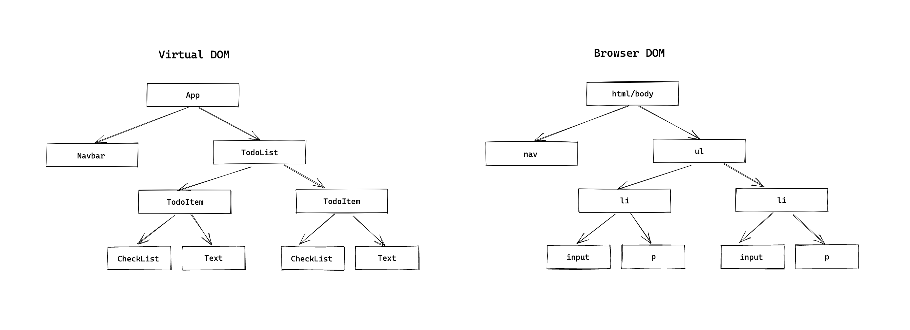
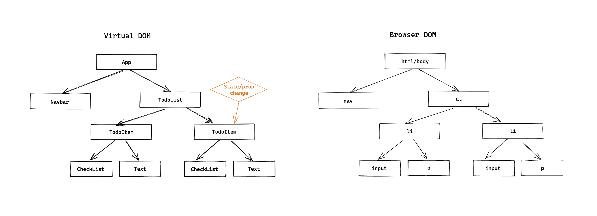

# OTUS

## Javascript Basic

<!-- s -->

## `Оптимизация производительности`

## `React приложений`

<!-- v -->

### Маршрут вебинара

1. Как работает React
1. Как избежать ненужных рендерингов
1. Ленивая загрузка компонент
1. Профилирование. Дебаг производительности

<!-- s -->

### [Как работает React](https://dev.to/kedark/how-the-react-updates-dom-1kc7)

<!-- v -->

React создает **Virtual DOM** для построение дерево компонентов.

<!-- v -->

Манипуляции сперва происходят с VDOM, и после React сравнивает с DOM, и **применяет все изменения**.

<!-- v -->



<!-- v -->

React рендерит всю ветку компонент

<!-- v -->



<!-- v -->

1. Рендеринг Virtual DOM
2. Коммит изменений в Browser DOM

<!-- v -->

Таким образом, основное React уже оптимизирует из под капота

<!-- v -->

**Базовый совет!!!**

[Используйте production build](https://reactjs.org/docs/optimizing-performance.html#use-the-production-build)

Не будет лишнего дев кода: warnings, prop-types

<!-- s -->

### Как избежать ненужных рендерингов

<!-- v -->

**1. [Мемоизация компонента](https://dev.to/nibble/react-memo-and-react-purecomponent-3k7k)**

<!-- v -->

shouldComponentUpdate

- для классовых компонент
- shallow comparison of state & props

```jsx
class MyComponent extends React.Component {
  shouldComponentUpdate(nextProps, nextState) {
    return this.props !== nextProps && this.state !== nextState;
  }

  render() {
    return <div>...</div>;
  }
}
```

<!-- v -->

React.PureComponent

- для классовых компонент
- shallow comparison of state & props

```jsx
class MyComponent extends React.PureComponent {
  render() {
    return <div>...</div>;
  }
}
```

<!-- v -->

React.memo HOC

- для функциональных компонент
- shallow comparison of props

```jsx
const MyComponent = React.memo(() => {
  return <div>...</div>;
});
```

<!-- v -->

[Примеры](https://codesandbox.io/s/floral-hill-6ueb6?file=/src/App.js)

<!-- v -->

**2. [Списки "key"](https://reactjs.org/docs/lists-and-keys.html#keys)**

<!-- v -->

```jsx
function Example({ items }) {
  return (
    <ul>
      {items.map((item) => (
        <li>{item.title}</li>
      ))}
    </ul>
  );
}
```

<!-- v -->

Для улучшения производительности. Key

```jsx
function Example({ items }) {
  return (
    <ul>
      {items.map((item) => (
        <li key={item.id}>{item.title}</li>
      ))}
    </ul>
  );
}
```

<!-- v -->

- Не является частью `props` !!
- Оптимизация обработки изменений в списках
- Уникальный в рамках списка
- Привязан к данным, а не к положению данных в списке

<!-- v -->

**3. [Виртуальные списки](https://reactjs.org/docs/optimizing-performance.html#virtualize-long-lists)**

<!-- v -->

**4. Для функциональных компонент**

<!-- v -->

[React.useMemo](https://reactjs.org/docs/hooks-reference.html#usememo)

```jsx
function MyComponent({ items }) {
  const average = useMemo(() => computeExpensiveValue(items), [items]);

  return <p>{average}</p>;
}
```

<!-- v -->

[React.useCallback](https://reactjs.org/docs/hooks-reference.html#usecallback)

```jsx
function MyComponent({ a, b }) {
  const onClick = useCallback(() => {
    // do something
  }, [a, b]);

  return <AnotherComponent onClick={onClick} />;
}
```

<!-- v -->

Вопросы?

<!-- s -->

### [Ленивая загрузка компонент](https://ru.reactjs.org/docs/code-splitting.html#bundling)

<!-- v -->

Используется для разделения кода/bundle'а и поздней/ленивой загрузки

```jsx
import React, { Suspense } from "react";

const OtherComponent = React.lazy(() => import("./OtherComponent"));

function MyComponent() {
  return (
    <div>
      <Suspense fallback={<div>Загрузка...</div>}>
        <OtherComponent />
      </Suspense>
    </div>
  );
}
```

<!-- v -->

Через динамический "import()" webpack (или другой сборщик) разделит код на несколько bundle'ов.

<!-- v -->

1. Загрузиться основой код компонента
2. После отрисовки, на клиенте сделается ещё запрос на получение кода ленивой компоненты

<!-- v -->

[Пример](https://codesandbox.io/s/optimizing-react-app-6ueb6?file=/src/App.js)

<!-- v -->

Разделение кода на основе маршрутов

```jsx
import React, { Suspense, lazy } from "react";
import { BrowserRouter as Router, Route, Switch } from "react-router-dom";

const Home = lazy(() => import("./routes/Home"));
const About = lazy(() => import("./routes/About"));

const App = () => (
  <Router>
    <Suspense fallback={<div>Загрузка...</div>}>
      <Switch>
        <Route exact path="/" component={Home} />
        <Route path="/about" component={About} />
      </Switch>
    </Suspense>
  </Router>
);
```

<!-- v -->

Вопросы?

<!-- s -->

### [Профилирование. Дебаг производительности](https://reactjs.org/blog/2018/09/10/introducing-the-react-profiler.html)

<!-- v -->

- Devtools extension
- показывает какие компоненты были отрендерены и почему
- показывает сколько времени ушло на каждый компонент
- возможность подсвечивать обновления в браузере

<!-- v -->

[Пример](https://codesandbox.io/s/optimizing-react-app-6ueb6?file=/src/ProfilerExample/index.js)

<!-- v -->

[React.Profiler component](https://reactjs.org/docs/profiler.html#onrender-callback)

- программный доступ к профилированию

```jsx
import React, { Profiler } from "react";

const MyComponent = (props) => (
  <Profiler id="StockChart" onRender={logTimes}>
    <StockChart>{/* ... */}</StockChart>
  </Profiler>
);

const logTimes = (id, phase, actualTime, baseTime, startTime, commitTime) => {
  console.log(`${id}'s ${phase} phase:`);
  console.log(`Actual time: ${actualTime}`);
  console.log(`Base time: ${baseTime}`);
  console.log(`Start time: ${startTime}`);
  console.log(`Commit time: ${commitTime}`);
};
```

<!-- v -->

- [По умолчанию выключено для production сборки](https://gist.github.com/bvaughn/25e6233aeb1b4f0cdb8d8366e54a3977)
- Можно включить "`yarn build --profile`"

<!-- v -->

- Профилирует всё дерево дочерних компонент
- Можно использовать более одного Profiler компонент
- Можно использовать вложено

<!-- v -->

Вопросы?

<!-- s -->

[Практика](https://codesandbox.io/s/optimizing-react-app-6ueb6?file=/src/Practice/index.js)

<!-- v -->

Вопросы?

<!-- s -->

### Дополнительные материалы

- [21 Performance Optimization Techniques for React Apps](https://www.codementor.io/blog/react-optimization-5wiwjnf9hj)
