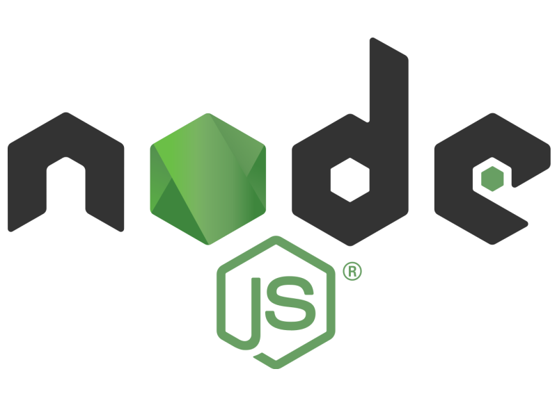
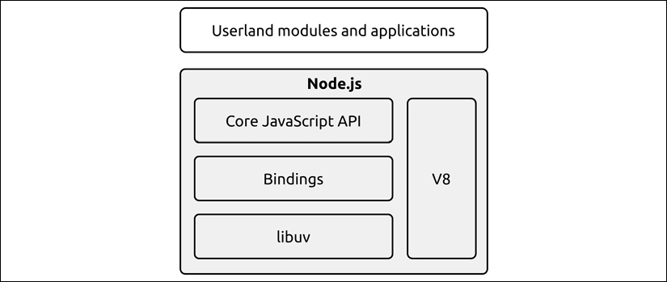

# OTUS

## Javascript Basic

<!-- v -->



<!-- s -->

### План занятия

- краткое описание встроенных модулей **node.js**
- примеры использования **os**/**fs**
- практика работы с **inquirer**
- практика работы с **commander**

<!-- v -->

### Архитектура Node.js



<!-- v -->

### [Встроенные модули Node.js](https://nodejs.org/dist/latest-v14.x/docs/api/)

- [Crypto](https://nodejs.org/dist/latest-v14.x/docs/api/crypto.html)
- [Buffer](https://nodejs.org/dist/latest-v14.x/docs/api/process.html)
- [Process](https://nodejs.org/dist/latest-v14.x/docs/api/process.html)
- [File System](https://nodejs.org/dist/latest-v14.x/docs/api/fs.html)
- [HTTP](https://nodejs.org/dist/latest-v14.x/docs/api/http.html)/[HTTPS](https://nodejs.org/dist/latest-v14.x/docs/api/https.html)/[HTTP2](https://nodejs.org/dist/latest-v14.x/docs/api/http2.html)
- [Os](https://nodejs.org/dist/latest-v14.x/docs/api/os.html)
- [Path](https://nodejs.org/dist/latest-v14.x/docs/api/path.html)
- [Readline](https://nodejs.org/dist/latest-v14.x/docs/api/readline.html)
- [Stream](https://nodejs.org/dist/latest-v14.x/docs/api/stream.html)
- ...

<!-- v -->

### [OS](https://nodejs.org/dist/latest-v14.x/docs/api/os.html)

Модуль предоставляет служебные методы и свойства, относящиеся к операционной системе.

```js
const os = require("os");
```

<!-- v -->

## Примеры

<!-- v -->

### [File System](https://nodejs.org/dist/latest-v14.x/docs/api/fs.html)

Данный модуль позволяет взаимодействовать с файловой системой способом, смоделированным на основе стандартных функций POSIX.

```js
const fs = require("fs");
```

<!-- v -->

### Классы модуля FS

- fs.Dir
- fs.Dirent
- fs.StatWatcher
- fs.ReadStream
- fs.Stats
- fs.WriteStream

**FS Promise API** предоставляет дополнительный класс `FileHandle`

<!-- v -->

## Примеры

<!-- v -->

### [Inquirer](https://www.npmjs.com/package/inquirer)

Встраиваемый CLI интерфейс для `Node.js`.
**Inquirer** позволяет осуществлять множественные настраиваемые запросы на ввод пользователем, проверять полученные ответы, а также получать обратную связь в случае ошибочного ввода.

<!-- v -->

## Практика использования

<!-- v -->

### [Commander](https://www.npmjs.com/package/commander)

Продвинутая утилита для работы с CLI Node.js. Позволяет гибко настраивать работу с аргументами, переданными командной строке и создавать на их основе исполняемые команды

<!-- v -->

## Практика использования

<!-- v -->

## Спасибо за внимание!
