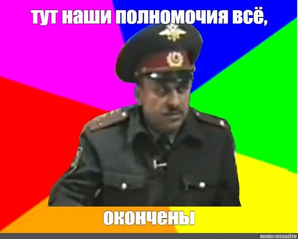
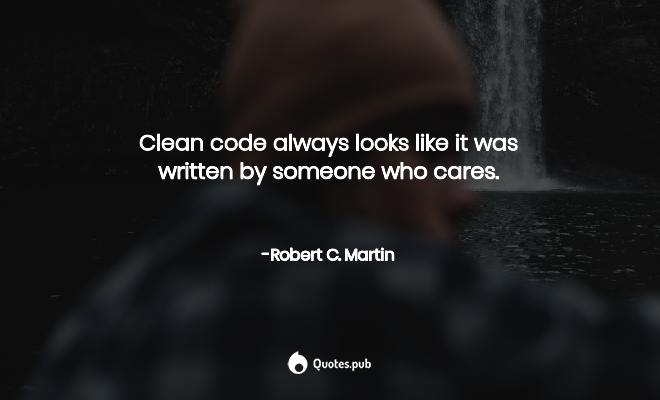

# OTUS

## Javascript Basic

<!-- v -->

### План занятия

- github markdown и его возможности
- readme
- общие рекомендации по оформлению проекта

<!-- s -->

## <span style="color: DarkMagenta">Github Markdown</span>

<!-- v -->

### Заголовки. <span style="color: LimeGreen">atx</span> формат

| <span style="color: LightSlateGrey">Markdown</span> | <span style="color: LightSlateGrey">HTML</span> | <span style="color: LightSlateGrey">Отображение</span> |
| --------------------------------------------------- | ----------------------------------------------- | ------------------------------------------------------ |
| # Heading 1                                         | `<h1>Heading 1</h1>`                            | <h1>Heading 1</h1>                                     |
| ## Heading 2                                        | `<h2>Heading 2</h2>`                            | <h2>Heading 2</h1>                                     |
| ### Heading 3                                       | `<h3>Heading 3</h3>`                            | <h3>Heading 3</h1>                                     |
| #### Heading 4                                      | `<h4>Heading 4</h4>`                            | <h4>Heading 4</h1>                                     |
| ##### Heading 5                                     | `<h5>Heading 5</h5>`                            | <h5>Heading 5</h1>                                     |
| ###### Heading 6                                    | `<h6>Heading 6</h6>`                            | <h6>Heading 6</h1>                                     |

<!-- v -->

### Заголовки. <span style="color: LimeGreen">Setext</span> формат

| <span style="color: LightSlateGrey">Markdown</span> | <span style="color: LightSlateGrey">HTML</span> | <span style="color: LightSlateGrey">Отображение</span> |
| --------------------------------------------------- | ----------------------------------------------- | ------------------------------------------------------ |
| `Heading 1` <br> `===`                              | `<h1>Heading 1</h1>`                            | <h1>Heading 1</h1>                                     |
| `Heading 2` <br> `---`                              | `<h2>Heading 2</h2>`                            | <h2>Heading 2</h1>                                     |

<!-- v -->

### Параграфы

| <span style="color: LightSlateGrey">Markdown</span>                   | <span style="color: LightSlateGrey">HTML</span>                                         | <span style="color: LightSlateGrey">Отображение</span>              |
| --------------------------------------------------------------------- | --------------------------------------------------------------------------------------- | ------------------------------------------------------------------- |
| Markdown is my favourite. <br><br> Now I will use it for all my docs. | `<p>Markdown is my favourite.</p>` <br><br> `<p>Now I will use it for all my docs.</p>` | Markdown is my favourite.<br><br>Now I will use it for all my docs. |

<!-- v -->

### Перевод строки

| <span style="color: LightSlateGrey">Markdown</span>               | <span style="color: LightSlateGrey">HTML</span>                                       | <span style="color: LightSlateGrey">Отображение</span>          |
| ----------------------------------------------------------------- | ------------------------------------------------------------------------------------- | --------------------------------------------------------------- |
| Markdown is my favourite. <br> Now I will use it for all my docs. | `<p>Markdown is my favourite.</p><br>`<br>`<p>Now I will use it for all my docs.</p>` | Markdown is my favourite.<br>Now I will use it for all my docs. |

<!-- v -->

### Выделение текста

| <span style="color: LightSlateGrey">Markdown</span> | <span style="color: LightSlateGrey">HTML</span> | <span style="color: LightSlateGrey">Отображение</span> |
| --------------------------------------------------- | ----------------------------------------------- | ------------------------------------------------------ |
| `**Bold**`                                          | `<strong>Bold</strong>`                         | **Bold**                                               |
| `__Bold__`                                          | `<strong>Bold</strong>`                         | **Bold**                                               |
| `*Italic*`                                          | `<em>Italic</em>`                               | _Italic_                                               |
| `_Italic_`                                          | `<em>Italic</em>`                               | _Italic_                                               |
| `~~Text~~`                                          | `<del>Text</del>`                               | ~~Text~~                                               |

<!-- v -->

### Блоки цитирования

| <span style="color: LightSlateGrey">Markdown</span> | <span style="color: LightSlateGrey">HTML</span>                                                               | <span style="color: LightSlateGrey">Отображение</span>                        |
| --------------------------------------------------- | ------------------------------------------------------------------------------------------------------------- | ----------------------------------------------------------------------------- |
| `> Markdown.`<br>`>`<br>`>>It's my favourite.`      | `<blockquote>`<br>`Markdown.`<br>`<blockquote>`<br>`It's my favourite.`<br>`</blockquote>`<br>`</blockquote>` | <blockquote>Markdown.<blockquote>It's my favourite.</blockquote></blockquote> |

<!-- v -->

### Списки. <span style="color: LimeGreen">Упорядоченные</span> списки

| <span style="color: LightSlateGrey">Markdown</span> | <span style="color: LightSlateGrey">HTML</span>                                | <span style="color: LightSlateGrey">Отображение</span> |
| --------------------------------------------------- | ------------------------------------------------------------------------------ | ------------------------------------------------------ |
| 1. First<br>2. Second<br>3. Third                   | `<ol>`<br>`<li>First</li>`<br>`<li>Second</li>`<br>`<li>Third</li>`<br>`</ol>` | <ol><li>First</li><li>Second</li><li>Third</li></ol>   |
| 1. First<br>1. Second<br>1. Third                   | `<ol>`<br>`<li>First</li>`<br>`<li>Second</li>`<br>`<li>Third</li>`<br>`</ol>` | <ol><li>First</li><li>Second</li><li>Third</li></ol>   |

<!-- v -->

### Списки. <span style="color: LimeGreen">Маркированные</span> списки

| <span style="color: LightSlateGrey">Markdown</span> | <span style="color: LightSlateGrey">HTML</span>            | <span style="color: LightSlateGrey">Отображение</span> |
| --------------------------------------------------- | ---------------------------------------------------------- | ------------------------------------------------------ |
| - First<br>- Second                                 | `<ul>`<br>`<li>First</li>`<br>`<li>Second</li>`<br>`</ul>` | <ul><li>First</li><li>Second</li></ul>                 |
| + First<br>+ Second                                 | `<ul>`<br>`<li>First</li>`<br>`<li>Second</li>`<br>`</ul>` | <ul><li>First</li><li>Second</li></ul>                 |

<!-- v -->

### Списки задач

| <span style="color: LightSlateGrey">Markdown</span> | <span style="color: LightSlateGrey">HTML</span>                                                                                                                                                               | <span style="color: LightSlateGrey">Отображение</span>                                                      |
| --------------------------------------------------- | ------------------------------------------------------------------------------------------------------------------------------------------------------------------------------------------------------------- | ----------------------------------------------------------------------------------------------------------- |
| `- [x] this is a complete item`                     | `<ul class="contains-task-list">`<br>`<li class="task-list-item">`<br>`<input type="checkbox" id="" disabled="" class="task-list-item-checkbox" checked="">`<br>this is a complete item<br>`</li>`<br>`</ul>` | <input type="checkbox" id="" disabled="" class="task-list-item-checkbox" checked="">this is a complete item |

<!-- v -->

### Код

| <span style="color: LightSlateGrey">Markdown</span> | <span style="color: LightSlateGrey">HTML</span>                                                        | <span style="color: LightSlateGrey">Отображение</span>                                                                                                                                                                           |
| --------------------------------------------------- | ------------------------------------------------------------------------------------------------------ | -------------------------------------------------------------------------------------------------------------------------------------------------------------------------------------------------------------------------------- |
| I'm \`nano\` code.                                  | `I'm <code>nano</code> code.`                                                                          | I'm <code style="background-color: lightgray">nano</code> code.                                                                                                                                                                  |
| \`\`\`js<br>const fs = require('fs')<br>\`\`\`      | `<pre>`<br>`<span class="pl-k">`<br>const<br>`</span>`<br>`<span>`fs...<br> = require('fs')<br>`<pre>` | <pre><span class="pl-k">const</span> <span class="pl-s1">fs</span> <span class="pl-c1">=</span> <span class="pl-en">require</span><span class="pl-kos">(</span><span class="pl-s">'fs'</span><span class="pl-kos">)</span></pre> |

<!-- v -->

### Таблицы

| <span style="color: LightSlateGrey">Markdown</span>                               | <span style="color: LightSlateGrey">HTML</span>                                                                   | <span style="color: LightSlateGrey">Отображение</span>                                                                                |
| --------------------------------------------------------------------------------- | ----------------------------------------------------------------------------------------------------------------- | ------------------------------------------------------------------------------------------------------------------------------------- |
| `\| A \| B \| C \|`<br>`\| --- \| --- \| --- \|`<br>`\| I \| love \| Markdown \|` | `<table>`<br>`<thead>`<br>`<tr>`<br>`<th>A</th>`<br>...<br>`</tr>`<br>`</thead>`<br>`<tbody>`<br>...<br>`<tbody>` | <table><thead><tr><th>A</th><th>B</th><th>C</th></tr></thead><tbody><tr><td>I</td><td>love</td><td>Markdown</td></tr></tbody></table> |

<!-- v -->

Выравнивание текста в таблицах достигается с помощью разделителей следующего вида

| <span style="color: LightSlateGrey">Default</span> | <span style="color: LightSlateGrey">Left align</span> | <span style="color: LightSlateGrey">Right align</span> | <span style="color: LightSlateGrey">Center align</span> |
| -------------------------------------------------- | :---------------------------------------------------- | -----------------------------------------------------: | :-----------------------------------------------------: |
| ---                                                | :--                                                   |                                                    --: |                           :-:                           |

<!-- v -->

### Горизонтальные разделители

| <span style="color: LightSlateGrey">Markdown</span> | <span style="color: LightSlateGrey">HTML</span> | <span style="color: LightSlateGrey">Отображение</span> |
| --------------------------------------------------- | ----------------------------------------------- | ------------------------------------------------------ |
| `***`<br><br>`---`<br><br>`____`                    | `<hr>`                                          | <hr>                                                   |

<!-- v -->

### Гиперссылки с немедленным указанием адреса

| <span style="color: LightSlateGrey">Markdown</span> | <span style="color: LightSlateGrey">HTML</span>                              | <span style="color: LightSlateGrey">Отображение</span> |
| --------------------------------------------------- | ---------------------------------------------------------------------------- | ------------------------------------------------------ |
| `[Duck Duck Go](https://duckduckgo.com)`            | `<a href="https://duckduckgo.com" rel="nofollow">`<br>Duck Duck Go<br>`</a>` | [Duck Duck Go](https://duckduckgo.com)                 |
| `[link](http://example.com#fragment)`               | `<a href="http://example.com#fragment" rel="nofollow">`<br>link<br>`</a>`    | [link](http://example.com#fragment)                    |

<!-- v -->

### Гиперссылки наподобие сноскам

| <span style="color: LightSlateGrey">Markdown</span> | <span style="color: LightSlateGrey">HTML</span>                     | <span style="color: LightSlateGrey">Отображение</span> |
| --------------------------------------------------- | ------------------------------------------------------------------- | ------------------------------------------------------ |
| `[Duck Go][id]:`<br>`[id]: https://duckgo.com`      | `<a href="https://duckgo.com" rel="nofollow">`<br>Duck Go<br>`</a>` | [Duck Go](https://duckgo.com)                          |

<!-- v -->

### Другие виды ссылок

- **SHA ссылки**:
  > hash  
  > username@hash
- **ссылки на Issue или PR**:
  > #1  
  > GH-#1  
  > username/github-flavored-markdown#1

<!-- v -->

### Изображения

| <span style="color: LightSlateGrey">Markdown</span> | <span style="color: LightSlateGrey">HTML</span>                                                                                                   | <span style="color: LightSlateGrey">Отображение</span> |
| --------------------------------------------------- | ------------------------------------------------------------------------------------------------------------------------------------------------- | ------------------------------------------------------ |
| ``              | `` |             |

<!-- v -->

### [Эмодзи](https://github.com/ikatyang/emoji-cheat-sheet/blob/master/README.md)

| <span style="color: LightSlateGrey">Markdown</span> | <span style="color: LightSlateGrey">HTML</span>                                                                                                          | <span style="color: LightSlateGrey">Отображение</span>                                                                                 |
| --------------------------------------------------- | -------------------------------------------------------------------------------------------------------------------------------------------------------- | -------------------------------------------------------------------------------------------------------------------------------------- |
| `:hugs:`                                            | `<g-emoji class="g-emoji" alias="hugs" fallback-src="https://github.githubassets.com/images/`<br>`icons/emoji/unicode/1f917.png">`<br>🤗<br>`</g-emoji>` | <g-emoji class="g-emoji" alias="hugs" fallback-src="https://github.githubassets.com/images/icons/emoji/unicode/1f917.png">🤗</g-emoji> |

<!-- v -->

### Упоминания

| <span style="color: LightSlateGrey">Markdown</span> | <span style="color: LightSlateGrey">HTML</span>                                                                                                                                                                                       | <span style="color: LightSlateGrey">Отображение</span>                                                                                                                                                                      |
| --------------------------------------------------- | ------------------------------------------------------------------------------------------------------------------------------------------------------------------------------------------------------------------------------------- | --------------------------------------------------------------------------------------------------------------------------------------------------------------------------------------------------------------------------- |
| **@Bronco**                                         | `<a class="user-mention" data-hovercard-type="user" data-hovercard-url="/users/Bronco/hovercard" data-octo-click="hovercard-link-click" data-octo-dimensions="link_type:self" href="https://github.com/Bronco">`<br>@Bronco<br>`</a>` | <a class="user-mention" data-hovercard-type="user" data-hovercard-url="/users/Bronco/hovercard" data-octo-click="hovercard-link-click" data-octo-dimensions="link_type:self" href="https://github.com/AntiHero">@Bronco</a> |

<!-- v -->

### [Escape последовательности](https://www.lexium.ru/2009/05/343/)

| <span style="color: LightSlateGrey">Markdown</span> | <span style="color: LightSlateGrey">HTML</span> | <span style="color: LightSlateGrey">Отображение</span> |
| --------------------------------------------------- | ----------------------------------------------- | ------------------------------------------------------ |
| `&lt;`                                              | `&lt;`                                          | &lt;                                                   |
| `&pi;`                                              | `&pi;`                                          | &pi;                                                   |
| `&rarr;`                                            | `&rarr;`                                        | &rarr;                                                 |

<!-- v -->

### На этом Github Markdown всё



<!-- v -->

### Материалы

1. [Официальная документация](https://docs.github.com/en/github/writing-on-github/getting-started-with-writing-and-formatting-on-github/basic-writing-and-formatting-syntax)
1. [Flavored markdown](https://github.github.com/gfm/#html-blocks)
1. ["Цветной" текст](https://stackoverflow.com/questions/11509830/how-to-add-color-to-githubs-readme-md-file#:~:text=Unfortunately%2C%20this%20is%20currently%20not,%3E%20%2C%20GitHub's%20discards%20any%20HTML.)
1. [Список доступных тэгов в github markdown](https://github.com/gjtorikian/html-pipeline/blob/main/lib/html/pipeline/sanitization_filter.rb#L44-L48)

<!-- s -->

## <span style="color: SkyBlue">Readme</span>

<!-- v -->

### Информативность

### Структурированность

<!-- v -->

## [Пример](https://github.com/AntiHero/Markdown/blob/master/README.md)

<!-- v -->

### Материалы

[Readme](https://docs.github.com/en/github/creating-cloning-and-archiving-repositories/creating-a-repository-on-github/about-readmes)  
[Как написать хороший Readme](https://www.freecodecamp.org/news/how-to-write-a-good-readme-file/)  
[Readme для npm и github](https://stackoverflow.com/questions/41297117/how-to-specify-different-readme-files-for-github-and-npm)

<!-- s -->

## <span style="color: SlateBlue">Общие рекомендации по оформлению проекта</span>

<!-- v -->

### Структура файлов и папок

1. [Соглашения по структуре папок](https://github.com/kriasoft/Folder-Structure-Conventions)
1. [Typescript Node.JS проект](https://github.com/microsoft/TypeScript-Node-Starter/blob/master/README.md#project-structure)
1. [React](https://www.robinwieruch.de/react-folder-structure)
1. [Junior vs Senior React Folder Structure](https://www.youtube.com/watch?v=UUga4-z7b6s)
1. [Структура проекта.Климов](https://www.youtube.com/watch?v=Sp8V-5k2ZaM)
1. [Npm workspaces](https://docs.npmjs.com/cli/v7/using-npm/workspaces)
1. [Express](https://blog.logrocket.com/organizing-express-js-project-structure-better-productivity/)

<!-- v -->

### Чистый код

<!-- v -->

### ~~Учимся~~ на ~~хороших~~ примерах

```js
/* Starting Project : XYZ (Please somebody shoot me!) */

// creating a;
const a = 5;
// creating b;
const b = 6;
// creating c;
const c = 4;
// checking if a triangle with such sides is rectangular
if (
  a ** 2 + b ** 2 === c ** 2 ||
  a ** 2 + c ** 2 === b ** 2 ||
  b ** 2 + c ** 2 === a ** 2
) {
  // TODO
}
```

<!-- v -->


<!-- v -->


<!-- v -->



<!-- v -->

### Материалы

- [Clean Code - Uncle Bob / Lesson 1](https://www.youtube.com/watch?v=7EmboKQH8lM)
- [Адаптация Чистого Кода для JS](https://github.com/ryanmcdermott/clean-code-javascript)
- [Пишем хорошие комментарии](https://stackoverflow.blog/2021/07/05/best-practices-for-writing-code-comments/)
- [Комментарии, Чистый Код и JavaScript](https://betterprogramming.pub/javascript-clean-code-comments-c926d5aae2cb)

<!-- s -->

## [Как оформить Readme своего профиля](https://docs.github.com/en/account-and-profile/setting-up-and-managing-your-github-profile/customizing-your-profile/managing-your-profile-readme)

<!-- v -->

### Материалы

- [Набор шаблонов для readme](https://github.com/kautukkundan/Awesome-Profile-README-templates)
- [Видео урок](https://www.youtube.com/watch?v=KhGWbt1dAKQ)

<!-- v -->

## [Домашнее задание](https://github.com/vvscode/otus--javascript-basic/blob/master/lessons/lesson50/homework.md)

<!-- v -->

## Оффтоп. Куда двигаться дальше?

<!-- v -->

- [JS](https://roadmap.sh/javascript)
- [NodeJS](https://roadmap.sh/nodejs)
- [React](https://roadmap.sh/react)
- [Frontend](https://roadmap.sh/frontend)
- [Backend](https://roadmap.sh/backend)

<!-- v -->

## Спасибо за внимание!
