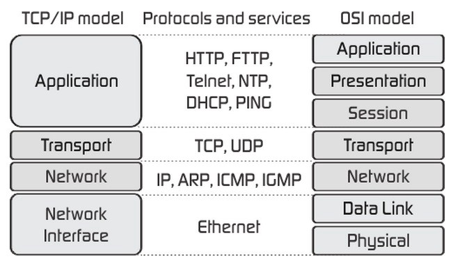
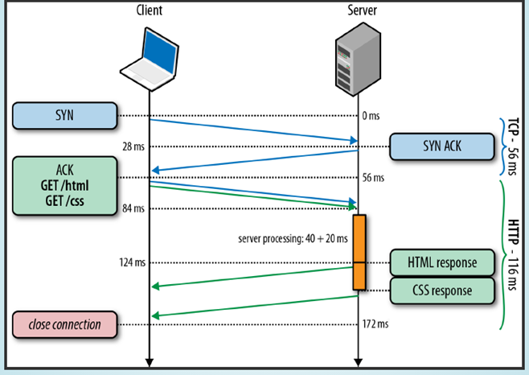
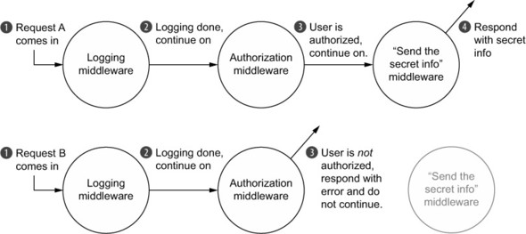

# OTUS

## Javascript Basic

<!-- v -->

### План занятия

- http-сервер
- express
- mongodb
- тестирование

<!-- s -->

## Напишем свой HTTP-сервер

#### но перед этим...

<!-- v -->

### TCP/IP и OSI модели



<!-- v -->

### HTTP-запрос



<!-- v -->

### Рассмотрим на примере

<!-- eslint skip -->

```
$ curl -v www.google.com
```

<!-- v -->

### Базовый http-сервер

```js
import http from "node:http";

const PORT = process.env.PORT || 9000;

const server = http.createServer((req, res) => {
  res.writeHead(200, { "Content-Type": "text/html" });
  res.write("<h1>Hello, Otus!</h1>");
  // Обязательно закрываем соединение!
  res.end();
});

server.listen(PORT, () => {
  console.log("Server is running at http://localhost:%s", PORT);
});
```

<!-- v -->

## Обслуживаем статику и роутинги

<!-- v -->

### Вопросы?

<!-- s -->

## [Express](https://expressjs.com/)

<!-- v -->

**Express** - это гибкий и минималистичный фреймворк, работающий поверх Node.js веб-сервера, который упрощает работу по созданию веб-приложений.

<!-- v -->

### Установка

```
$ npm install express --save
$ npm install @types/express --save-dev
```

<!-- v -->

### Порядок создания express-приложения

1. Импортируем все необходимые модули, утилиты и миддлвары
1. Создаём Express.js объект
1. Подключаемся к базам данных (MongoDB, Postgres, Redis и др.)
1. Производим настройку Express.js объекта при необходимости
1. Подключаем миддлвары - парсеры, миддлвары для работы со статикой, обработчики ошибок, cors и т.д.
1. Определяем роуты и соответствующие им обработчики запросов
1. Запускам сервер

<!-- v -->

### Перепишем наш http-сервер с использованием express

```js
import express from "express";

const port = process.env.PORT || 9000;

const app = express();

app.get("/", (req, res) => {
  res.send("<h1>Hello, Otus!</h1>");
});

app.listen(port, () => {
  console.log("Server is running at http://localhost:%s", PORT);
});
```

<!-- v -->

## Обслуживаем [статику](https://expressjs.com/en/starter/static-files.html) и роутинги с использованием express

<!-- s -->

## Использование шаблонизаторов в express

<!-- v -->

### Шаблонизаторы с которыми работает express

- Pug
- Mustache
- Ejs
- [ещё](https://expressjs.com/en/resources/template-engines.html)

<!-- v -->

### [Настраиваем работу с шаблонизатором](https://expressjs.com/en/guide/using-template-engines.html)

<!-- prettier-ignore -->
1. Устанавливаем шаблонизатор:  
<!-- eslint skip -->

```
$ npm install pug --save
```

2. Для свойства приложения `views`, определяющее директорию для хранения шаблонов, зададим необходимый путь:

```js
app.set("views", "./views");
```

3. Также, установим нужное значения для свойства `view engine`, отвечающее за используемый шаблонизатор:

```js
app.set("view engine", "pug");
```

4. Создаём файл шаблона index.pug:
<!-- eslint skip -->

```
html
  head
    title= title
  body
    h1= message
```

5. Создаём роут для итогового шаблона:

```js
app.get("/", function (req, res) {
  res.render("index", { title: "My Template", message: "Hello, Otus!" });
});
```

<!-- v -->

### Вопросы?

<!-- s -->

## Тестирование серверной части

<!-- v -->

### [Supertest](https://www.npmjs.com/package/supertest)

Данный модуль предоставляет высокоуровневую абстракцию для тестирования HTTP.

<!-- eslint skip -->

```
// Установка
$ npm install supertest @types/supertest --save-dev
```

<!-- v -->

### Вопросы?

<!-- s -->

## Express middlewares

<!-- v -->

За **middleware** в **Express** скрыта простая идея: вместо _одного_ монолитного обработчика запроса, мы можем вызывать _несколько_ обработчиков, каждый из которых выполняет свою определённую функцию.

<!-- v -->

### Пример прохождения двух запросов через middleware функции



<!-- v -->

### Пишем свой middleware

```js
import express from "express";

const requestLogger = (
  req: express.Request,
  _: express.Response,
  next: express.NextFunction
) => {
  console.log(req.url, " ", req.method);
  console.log("-------------------");
  next();
};
```

<!-- s -->

### [Cookie-session](https://www.npmjs.com/package/cookie-session)

<!-- v -->

Node.js модуль, с помощью которого можно создавать и управлять пользовательскими сессиями.

<!-- eslint skip -->

```
// Установка
$ npm install cookie-session --save
$ npm install @types/cookie-session --save-dev
```

```js
import session from "cookie-session";

const oneDay = 1000 * 60 * 60 * 24;

app.use(
  session({
    secret: "sfajnh4faAN99", // обязательное поле
    maxAge: oneDay,
  })
);
```

<!-- v -->

Для тестирования пользовательских сессий используем [supertest-session](https://www.npmjs.com/package/supertest-session).

<!-- eslint skip -->

```
// Установка
$ npm install supertest-session --save-dev
```

<!-- v -->

### Вопросы?

<!-- s -->

## [MongoDB](https://www.mongodb.com/)

<!-- v -->

**MongoDB** - масштабируемая, кросс-платформенная, [документо-ориентированная](https://en.wikipedia.org/wiki/Document-oriented_database) база данных.

<!-- v -->

**MongoDB** может быть установлена и запущена локально на нашем компьютере, в сети также присутствует множество сервисов предоставляющих возможность работы с **MongoDB**. Для нашего приложения мы выберем [**MongoDB Atlas**](https://www.mongodb.com/cloud/atlas).

<!-- v -->

### [Создание и настройка доступа к базе данных](https://youtu.be/fbYExfeFsI0?t=116)

<!-- v -->

Для интеграции **MongoDB** в наше приложение нам понадобится специальный драйвер. Можно использовать [**официальный MongoDB Node.js драйвер**](https://mongodb.github.io/node-mongodb-native/), но зачастую он вызывает много сложностей при использовании, поэтому мы воспользуемся другим популярным решением: [**mongoose**](https://www.npmjs.com/package/mongoose).

<!-- eslint skip -->

```
$ npm install mongoose
$ npm install @types/mongoose --save-dev
```

<!-- v -->

### Подключаемся к базе данных

```js
import mongoose from "mongoose";

// НЕ СОХРАНЯЕМ ДАННУЮ СТРОКУ НА GITHUB!
const url =
  "mongodb+srv://<USERNAME>:<PASSWORD>@cluster0-ostce.mongodb.net/<DB_NAME>?retryWrites=true";

console.log("connecting to", url);

mongoose
  .connect(url)
  .then((_) => {
    console.log("connected to MongoDB");
  })
  .catch((error) => {
    console.log("error connecting to MongoDB:", error.message);
  });
```

<!-- v -->

Данные в MongoDB хранятся в так называемых [**коллекциях**](https://docs.mongodb.com/manual/core/databases-and-collections/#collections) в виде [**документов**](https://docs.mongodb.com/manual/core/document/). Структура документа описывается с помощью специальной [**схемы**](https://mongoosejs.com/docs/guide.html), на основе которой, в свою очередь, создаётся [**модель**](https://mongoosejs.com/docs/models.html).

<!-- v -->

**Модели** - это так называемые функции-конструкторы, которые создают новые JavaScript объекты на основе предоставляемых параметров. Данные объекты обладают свойствами модели, включая различные методы. Экземпляром **модели** является **документ**.

<!-- v -->

### Опишем произвольную схему и на её основе создадим модель.

```ts
interface BookSchema {
  author: string;
  title: string;
  year: number;
}

const bookSchema = new mongoose.Schema<BookSchema>({
  author: String,
  title: { type: String, required: true },
  year: Number,
});

const Book = mongoose.model("Book", bookSchema);
```

<!-- v -->

### Используем базу данных в обработчике роутинга

```js
app.post("/api/books", (req, res) => {
  const { author, title, year } = req.body;

  const book = new Book({
    author,
    year,
    title,
  });

  book
    .save()
    .then((savedBook) => {
      res.json(savedBook);
    })
    .catch((e) => {
      console.log(e);
      res.status(400).send("Bad request");
    });
});
```

<!-- v -->

Для тестирования базы данных можно создать **отдельную (тестовую)** базу данных в MongoDB Atlas, к которой будут производиться запросы. Это не оптимальное решение, особенно в случае, если над проектом работает много людей, чьи изменения в базе данных могут конфликтовать.

<!-- v -->

Лучшим решением будет использование для каждого теста своей базы данных. Это сравнительного легко достигается за счёт запуска MongoDB в памяти компьютера, либо в Docker контейнере.

<!-- v -->

Пример тестирования базы данных.

```js
import mongoose from "mongoose";
import supertest from "supertest";
import app from "./app";

const api = supertest(app);

const initialBooks = [
  {
    author: "Mark Twain",
    date: 1876,
    title: "The Adventures of Tom Sawyer",
  },
];

beforeAll(async () => {
  await connectToMongoDb(process.env.MONGODB_URL_TEST as string);
  await Book.deleteMany({});

  let bookObj = new Book(initialBooks[0]);
  await bookObj.save();
});

afterAll(() => {
  mongoose.connection.close();
});

test("should return books as json", async () => {
  await api
    .get("/api/books")
    .expect(200)
    .expect("Content-Type", /application\/json/);
});

test("should return one book", async () => {
  const response = await api.get("/api/books");

  expect(response.body).toHaveLength(1);
});
```

<!-- v -->

### Вопросы?

<!-- s -->

## Размещение серверной части на сторонних ресурсах

<!-- v -->

### Размещение на [heroku](https://www.heroku.com/)\*

- [официальный мануал](https://devcenter.heroku.com/articles/getting-started-with-nodejs)
- [с использованием github actions](https://github.com/marketplace/actions/deploy-to-heroku)

_\* с 28.11.2022 heroku прекратил поддержку бесплатных планов_

<!-- v -->

### Размещение на [vercel](https://vercel.com/)

- [официальный мануал](https://vercel.com/guides/using-express-with-vercel)
- [stackoverflow](https://stackoverflow.com/questions/72133185/deploy-an-express-server-that-uses-express-static-to-serve-a-build-folder-to-ver)

<!-- v -->

### Вопросы?

<!-- s -->

## Инструменты для тестирования и разработки API

<!-- v -->

- [**Postman**](https://www.postman.com/)
- [**Insomnia**](https://insomnia.rest/)

<!-- v -->

## Что дальше?

<!-- v -->

### [Авторизация с помощью jwt токенов](https://fullstackopen.com/en/part4/token_authentication)

<!-- v -->

### [Express-validator](https://express-validator.github.io/docs/)

<!-- v -->

## Спасибо за внимание!
